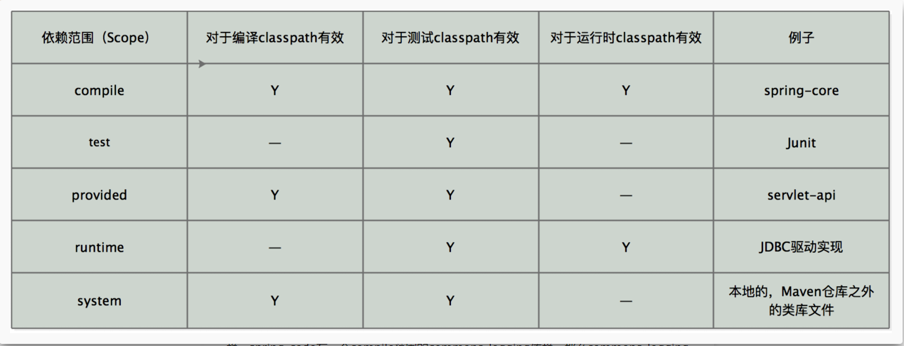
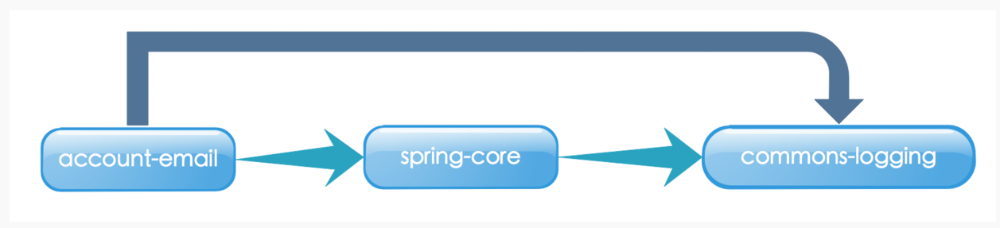
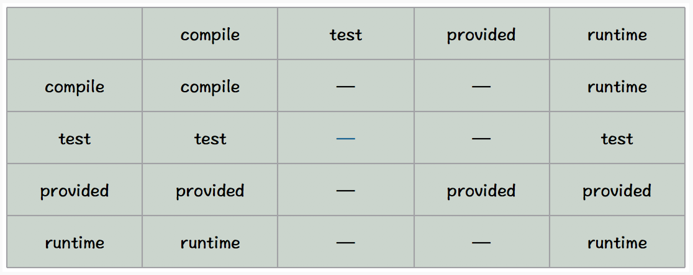
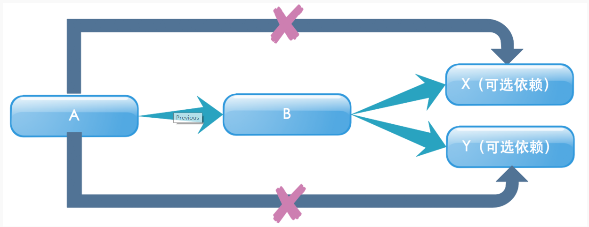

# [Maven](http://tengj.top/2018/01/01/maven/)

[官网](http://maven.apache.org/download.cgi)

### 常用命令说明

**mvn clean：**表示运行清理操作（会默认把target文件夹中的数据清理）。
**mvn clean compile：**表示先运行清理之后运行编译，会将代码编译到target文件夹中。
**mvn clean test：**运行清理和测试。
**mvn clean package：**运行清理和打包。
**mvn clean install：**运行清理和安装，会将打好的包安装到本地仓库中，以便其他的项目可以调用。
**mvn clean deploy：**运行清理和发布（发布到私服上面）。

### 常用POM属性

```xml
${project.build.sourceDirectory}:项目的主源码目录，默认为src/main/java/. 
${project.build.testSourceDirectory}:项目的测试源码目录，默认为/src/test/java/.
${project.build.directory}:项目构建输出目录，默认为target/.
${project.build.outputDirectory}:项目主代码编译输出目录，默认为target/classes/.
${project.build.testOutputDirectory}:项目测试代码编译输出目录，默认为target/testclasses/.
${project.groupId}:项目的groupId.
${project.artifactId}:项目的artifactId.
${project.version}:项目的version,于${version}等价
${project.build.finalName}:项目打包输出文件的名称，默认为${project.artifactId}${project.version}.
```

### POM.XML头部

```
<?xml version="1.0" encoding="UTF-8"?>
<project xmlns="http://maven.apache.org/POM/4.0.0" xmlns:xsi="http://www.w3.org/2001/XMLSchema-instance"
    xsi:schemaLocation="http://maven.apache.org/POM/4.0.0 http://maven.apache.org/xsd/maven-4.0.0.xsd">
    <modelVersion>4.0.0</modelVersion>
    <groupId>com.tengj</groupId>
    <artifactId>springBootDemo1</artifactId>
    <version>0.0.1-SNAPSHOT</version>
    <name>springBootDemo1</name>
</project>
```

代码的第一行是XML头，指定了该xml文档的版本和编码方式。
project是所有pom.xml的根元素，它还声明了一些POM相关的命名空间及xsd元素。
根元素下的第一个子元素modelVersion指定了当前的POM模型的版本，对于Maven3来说，它只能是4.0.0
代码中最重要是包含了groupId,artifactId和version了。这三个元素定义了一个项目基本的坐标，在Maven的世界，任何的jar、pom或者jar都是以基于这些基本的坐标进行区分的。

groupId定义了项目属于哪个组，随意命名，比如谷歌公司的myapp项目，就取名为 com.google.myapp

artifactId定义了当前Maven项目在组中唯一的ID,比如定义hello-world。

version指定了项目当前的版本0.0.1-SNAPSHOT,SNAPSHOT意为快照，说明该项目还处于开发中，是不稳定的。

name元素生命了一个对于用户更为友好的项目名称，虽然这不是必须的，但还是推荐为每个POM声明name,以方便信息交流

### 依赖的配置（dependency）

```
<project>
...
<dependencies>
    <dependency>
        <groupId>实际项目</groupId>
　　　　 <artifactId>模块</artifactId>
　　　　 <version>版本</version>
　　　　 <type>依赖类型</type>
　　　　 <scope>依赖范围</scope>
　　　　 <optional>依赖是否可选</optional>
　　　　 <!—主要用于排除传递性依赖-->
　　　　 <exclusions>
　　　　     <exclusion>
　　　　　　　    <groupId>…</groupId>
　　　　　　　　　 <artifactId>…</artifactId>
　　　　　　　</exclusion>
　　　　 </exclusions>
　　</dependency>
<dependencies>
...
</project>
```

根元素project下的dependencies可以包含一个或者多个dependency元素，以声明一个或者多个项目依赖。每个依赖可以包含的元素有：

- **grounpId、artifactId和version**:以来的基本坐标，对于任何一个依赖来说，基本坐标是最重要的，Maven根据坐标才能找到需要的依赖。
- **type**:依赖的类型，对于项目坐标定义的packaging。大部分情况下，该元素不必声明，其默认值为jar
- **scope**:依赖的范围
- **optional**:标记依赖是否可选
- **exclusions**:用来排除传递性依赖

### 依赖范围（scope）

依赖范围就是用来控制依赖和三种classpath(编译classpath，测试classpath、运行classpath)的关系，Maven有如下几种依赖范围：

- **compile:**编译依赖范围。如果没有指定，就会默认使用该依赖范围。使用此依赖范围的Maven依赖，对于编译、测试、运行三种classpath都有效。典型的例子是spring-code,在编译、测试和运行的时候都需要使用该依赖。
- **test:** 测试依赖范围。使用次依赖范围的Maven依赖，只对于测试classpath有效，在编译主代码或者运行项目的使用时将无法使用此依赖。典型的例子是Jnuit,它只有在编译测试代码及运行测试的时候才需要。
- **provided:**已提供依赖范围。使用此依赖范围的Maven依赖，对于编译和测试classpath有效，但在运行时候无效。典型的例子是servlet-api,编译和测试项目的时候需要该依赖，但在运行项目的时候，由于容器以及提供，就不需要Maven重复地引入一遍。
- **runtime:**运行时依赖范围。使用此依赖范围的Maven依赖，对于测试和运行classpath有效，但在编译主代码时无效。典型的例子是JDBC驱动实现，项目主代码的编译只需要JDK提供的JDBC接口，只有在执行测试或者运行项目的时候才需要实现上述接口的具体JDBC驱动。
- **system:**系统依赖范围。该依赖与三种classpath的关系，和provided依赖范围完全一致，但是，使用system范围的依赖时必须通过systemPath元素显示地指定依赖文件的路径。由于此类依赖不是通过Maven仓库解析的，而且往往与本机系统绑定，可能构成构建的不可移植，因此应该谨慎使用。systemPath元素可以引用环境变量，如：
- **import:**导入依赖范围。该依赖范围不会对三种classpath产生实际的影响。



### 传递性依赖

比如一个account-email项目为例，account-email有一个compile范围的spring-code依赖，spring-code有一个compile范围的commons-logging依赖，那么commons-logging就会成为account-email的compile的范围依赖，commons-logging是account-email的一个传递性依赖



有了传递性依赖机制，在使用Spring Framework的时候就不用去考虑它依赖了什么，也不用担心引入多余的依赖。Maven会解析各个直接依赖的POM，将那些必要的间接依赖，以传递性依赖的形式引入到当前的项目中。

### 依赖范围

假设A依赖于B,B依赖于C，我们说A对于B是第一直接依赖，B对于C是第二直接依赖，A对于C是传递性依赖。第一直接依赖和第二直接依赖的范围决定了传递性依赖的范围，如下图所示，最左边一行表示第一直接依赖范围，最上面一行表示第二直接依赖范围，中间的交叉单元格则表示传递依赖范围。



从上图中，我们可以发现这样的规律：

- 当第二直接依赖的范围是compile的时候，传递性依赖的范围与第一直接依赖的范围一致；
- 当第二直接依赖的范围是test的时候，依赖不会得以传递；
- 当第二直接依赖的范围是provided的时候，只传递第一直接依赖范围也为provided的依赖，切传递依赖的范围同样为provided;
- 当第二直接依赖的范围是runtime的时候，传递性依赖的范围与第一直接依赖的范围一致，但compile列外，此时传递性依赖范围为runtime.

### 依赖调解

当依赖发生冲突时会根据以下两条规则进行调解

1. 路径最近者优先
   比如项目有A有这样的依赖关系：A->B->C->X(1.0)、A->D->X(2.0),X是A的传递性依赖，但是两条依赖路径上有两个版本的X，所以根据第一原则，A->D->X(2.0)路径短，所以X(2.0)会被解析使用
2. 第一声明者优先
   如果路径都一样长的话，第一原则就不行了，比如 A->B->Y(1.0)、A->C->Y(2.0),Y(1.0)和Y(2.0)的路径一样，所以这时候根据第二原则，先声明的被解析。

### 可选依赖



如图，项目中A依赖B，B依赖于X和Y，如果所有这三个的范围都是compile的话，那么X和Y就是A的compile范围的传递性依赖，但是如果我想X,Y不作为A的传递性依赖，不给他用的话。就需要下面提到的配置可选依赖。

```
<project>  
    ………
    <dependencies>  
        <dependency>  
            <groupId>mysql</groupId>  
            <artifactId>mysql-connector-java</artifactId>  
            <version>5.1.10</version>  
            <optional>true</optional>  
        </dependency>  
        <dependency>  
            <groupId>postgresql</groupId>  
            <artifactId>postgresql</groupId>  
            <version>8.4-701.jdbc3</version>  
            <optional>true</optional>  
        </dependency>  
    </dependencies>  
</project>
```

### 排除依赖

有时候你引入的依赖中包含你不想要的依赖包，你想引入自己想要的，这时候就要用到排除依赖了，比如下图中spring-boot-starter-web自带了logback这个日志包，我想引入log4j2的，所以我先排除掉logback的依赖包，再引入想要的包就行了

```
<exclusions>
    <exclusion>
        <groupId>org.springframework.boot</groupId>
        <artifactId>spring-boot-starter-logging</artifactId>
    </exclusion>
</exclusions>
```

这里注意：声明exclustion的时候只需要groupId和artifactId，而不需要version元素，这是因为只需要groupId和artifactId就能唯一定位依赖图中的某个依赖。

### 归类依赖

有时候我们引入的很多依赖包，他们都来自同一个项目的不同模块，所以他们的版本号都一样，这时候我们可以用属性来统一管理版本号

```
<project>  
    ……
    <properties>  
        <springframework.version>1.5.6</springframework.version>  
    </properties>  
    <dependencies>  
        <dependency>  
            <groupId>org.springframework</groupId>  
            <artifactId>spring-core</artifactId>  
            <version>${springframework.version}</version>  
        </dependency>   
        <dependency>  
            <groupId>org.springframework</groupId>  
            <artifactId>spring-beans</artifactId>  
            <version>${springframework.version}</version>  
        </dependency>         
    </dependencies>  
</project>
```

