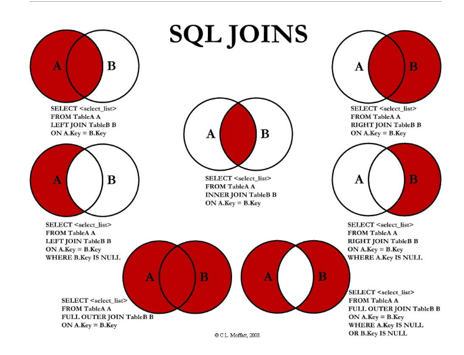

#### RDBMS即关系数据库管理系统(Relational Database Management System)的特点：

- 数据以表格的形式出现
- 每行为各种记录名称
- 每列为记录名称所对应的数据域
- 许多的行和列组成一张表单
- 若干的表单组成database


####数据库的名词解释


- **数据库:** 数据库是一些关联表的集合。.
- **数据表:** 表是数据的矩阵。在一个数据库中的表看起来像一个简单的电子表格。
- **列:** 一列(数据元素) 包含了相同的数据, 例如邮政编码的数据。
- **行：**一行（=元组，或记录）是一组相关的数据，例如一条用户订阅的数据。
- **冗余**：存储两倍数据，冗余可以使系统速度更快。
- **主键**：主键是唯一的。一个数据表中只能包含一个主键。你可以使用主键来查询数据。
- **外键：**外键用于关联两个表。
- **复合键**：复合键（组合键）将多个列作为一个索引键，一般用于复合索引。
- **索引：**使用索引可快速访问数据库表中的特定信息。索引是对数据库表中一列或多列的值进行排序的一种结构。类似于书籍的目录。
- **参照完整性:** 参照的完整性要求关系中不允许引用不存在的实体。与实体完整性是关系模型必须满足的完整性约束条件，目的是保证数据的一致性

#### 管理的命令：

- show databases：列出数据库schema列表
- show tables：显示指定schema的所有表
- show columns from table：显示数据表中所有属性、属性类型、主键信息等
- show index from table：显示数据表的详细索引信息
- show table status like [table] \G：显示数据库管理系统的性能及统计信息

```
mysql> SHOW TABLE STATUS  FROM W3CSCHOOL;   # 显示数据库 W3CSCHOOL 中所有表的信息
mysql> SHOW TABLE STATUS from W3CSCHOOL LIKE 'W3Cschool%';     # 表名以W3Cschool开头的表的信息
mysql> SHOW TABLE STATUS from W3CSCHOOL LIKE 'W3Cschool%'\G;   # 加上 \G，查询结果按列打印
```

#### [MySQL数据类型](https://www.w3cschool.cn/mysql/mysql-data-types.html)

大致可以分为三类：数值、日期/时间和字符串(字符)类型

##### 连接：

- **INNER JOIN（内连接,或等值连接）**：获取两个表中字段匹配关系的记录。
- **LEFT JOIN（左连接）：**获取左表所有记录，即使右表没有对应匹配的记录。
- **RIGHT JOIN（右连接）：** 与 LEFT JOIN 相反，用于获取右表所有记录，即使左表没有对应匹配的记录。




