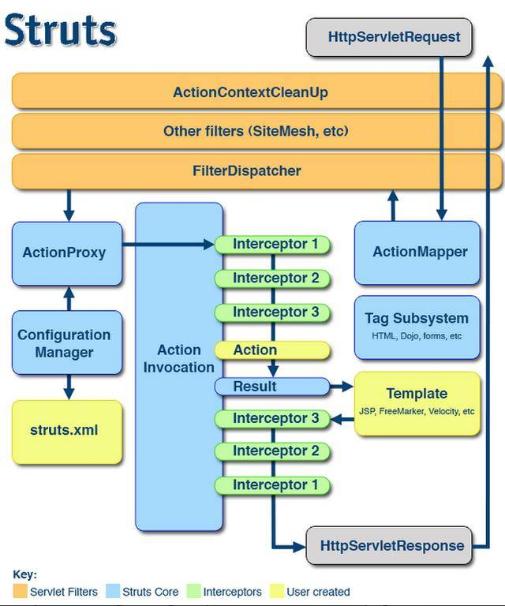

关于SSH框架： SSH框架则是Struts2，Spring和Hibernate框架的整合，其中Struts2 做控制器(controller)，spring 管理各层的组件，hibernate 负责持久化层。 

### hibernate

1. 对JDBC访问数据库的代码做了封装，大大简化了数据访问层繁琐的重复性代码。
2. Hibernate是一个基于JDBC的主流持久化框架，是一个优秀的ORM实现。他很大程度的简化DAO层的编码工作
3. hibernate使用Java反射机制，而不是字节码增强程序来实现透明性。
4. hibernate的性能非常好，因为它是个轻量级框架。映射的灵活性很出色。它支持各种关系数据库，从一对一到多对多的各种复杂关系。 原理： 
   1. 通过Configuration().configure();读取并解析hibernate.cfg.xml配置文件 
   2. 由hibernate.cfg.xml中的读取并解析映射信息 
   3. 通过config.buildSessionFactory();//创建SessionFactory 
   4. sessionFactory.openSession();//打开Sesssion 
   5. session.beginTransaction();//创建事务Transation 
   6. persistent operate持久化操作 
   7. session.getTransaction().commit();//提交事务 
   8. 关闭Session 
   9. 关闭SesstionFactory

### Struts2

Struts 2框架本身大致可以分为3个部分：核心控制器FilterDispatcher、业务控制器Action和用户实现的企业业务逻辑组件。

核心控制器FilterDispatcher是Struts2框架的基础，包含了框架内部的控制流程和处理机制。

业务控制器Action和业务逻辑组件是需要用户来自己实现的。用户在开发Action和业务逻辑组件的同时，还需要编写相关的配置文件，供核心控制器FilterDispatcher来使用。 

Struts2的工作流程相对于Struts1要简单，与WebWork框架基本相同，所以说Struts2是WebWork的升级版本。基本简要流程如下：

1. 客户端浏览器发出HTTP请求。
2. 根据web.xml配置，该请求被FilterDispatcher接收。
3. 根据struts.xml配置，找到需要调用的Action类和方法， 并通过IoC方式，将值注入给Aciton。
4. Action调用业务逻辑组件处理业务逻辑，这一步包含表单验证。
5. Action执行完毕，根据struts.xml中的配置找到对应的返回结果result，并跳转到相应页面。
6. 返回HTTP响应到客户端浏览器。

Struts的工作流程: 

- 在web应用启动时就会加载初始化ActionServlet,
- ActionServlet从 struts-config.xml文件中读取配置信息,把它们存放到各种配置对象 当ActionServlet接收到一个客户请求时,将执行如下流程. 
  1. 检索和用户请求匹配的ActionMapping实例,如果不存在,就返回请求路径无效信息;
  2. 如果ActionForm实例不存在,就创建一个ActionForm对象,把客户提交的表单数据保存到ActionForm对象中; 
  3. 根据配置信息决定是否需要表单验证.如果需要验证,就调用ActionForm的validate()方法; 
  4. 如果ActionForm的validate()方法返回null或返回一个不包含ActionMessage的ActuibErrors对象, 就表示表单验证成功; 
  5. ActionServlet根据ActionMapping所包含的映射信息决定将请求转发给哪个Action,如果相应的 Action实例不存在,就先创建这个实例,然后调用Action的execute()方法; 
  6. Action的execute()方法返回一个ActionForward对象,ActionServlet在把客户请求转发给 ActionForward对象指向的JSP组件; 
  7. ActionForward对象指向JSP组件生成动态网页,返回给客户;

### Spring

Spring 框架是一个分层架构，由 7 个定义良好的模块组成。Spring 模块构建在核心容器之上，核心容器定义了创建、配置和管理 bean 的方式。 组成 Spring 框架的每个模块（或组件）都可以单独存在，或者与其他一个或多个模块联合实现。每个模块的功能如下： 

- 核心容器：核心容器提供 Spring 框架的基本功能。核心容器的主要组件是 BeanFactory，它是工厂模式的实现。BeanFactory 使用控制反转 （IOC）模式将应用程序的配置和依赖性规范与实际的应用程序代码分开。 Spring 框架的功能可以用在任何 J2EE 服务器中，大多数功能也适用于不受管理的环境。Spring 的核心要点是：支持不绑定到特定 J2EE 服务的可重用业务和数据访问对象。毫无疑问，这样的对象可以在不同 J2EE 环境 （Web 或 EJB）、独立应用程序、测试环境之间重用。

IOC 和 AOP 控制反转模式（也称作依赖性介入）的基本概念是：不创建对象，但是描述创建它们的方式。在代码中不直接与对象和服务连接，但在配置文件中描述哪一个组件需要哪一项服务。容器（在 Spring 框架中是 IOC 容器） 负责将这些联系在一起。 在典型的 IOC 场景中，容器创建了所有对象，并设置必要的属性将它们连接在一起，决定什么时间调用方法。

Spring 设计的核心是 org.springframework.beans包，它的设计目标是与JavaBean组件一起使用。这个包通常不是由用户直接使用，而是由服务器将其用作其他多数功能的底层中介。下一个最高级抽象是BeanFactory接口，它是工厂设计模式的实现，允许通过名称创建和检索对象。BeanFactory 也可以管理对象之间的关系。 

BeanFactory 支持两个对象模型。

- 单态 模型提供了具有特定名称的对象的共享实例，可以在查询时对其进行检索。Singleton 是默认的也是最常用的对象模型。对于无状态服务对象很理想。 

- 原型 模型确保每次检索都会创建单独的对象。在每个用户都需要自己的对象时，原型模型最适合。 

bean 工厂的概念是 Spring 作为 IOC 容器的基础。IOC 将处理事情的责任从应用程序代码转移到框架。正如我将在下一个示例中演示的那样，Spring 框架使用 JavaBean 属性和配置数据来指出必须设置的依赖关系。 BeanFactory 接口 因为 org.springframework.beans.factory.BeanFactory 是一个简单接口，所以可以针对各种底层存储方法实现。最常用的 BeanFactory 定义是 XmlBeanFactory，它根据 XML 文件中的定义装入 bean，在 XML 文件中定义的 Bean 是被消极加载的，这意味在需要 bean 之前，bean 本身不会被初始化。要从 BeanFactory 检索 bean，只需调用 getBean() 方法，传入将要检索的 bean 的名称即可，每个 bean 的定义都可以是 POJO （用类名和 JavaBean 初始化属性定义） 或 FactoryBean。FactoryBean 接口为使用 Spring 框架构建的应用程序添加了一个间接的级别。 

总结：SSM和SSH不同主要在MVC实现方式，以及ORM持久化方面不同（Hiibernate与Mybatis）。SSM越来越轻量级配置，将注解开发发挥到极致，且ORM实现更加灵活，SQL优化更简便；而SSH较注重配置开发，其中的Hiibernate对JDBC的完整封装更面向对象，对增删改查的数据维护更自动化，但SQL优化方面较弱，且入门门槛稍高。

作者：伊竹凌

链接：https://juejin.im/post/5a715f4ef265da3e5a57935f

来源：掘金

著作权归作者所有。商业转载请联系作者获得授权，非商业转载请注明出处。