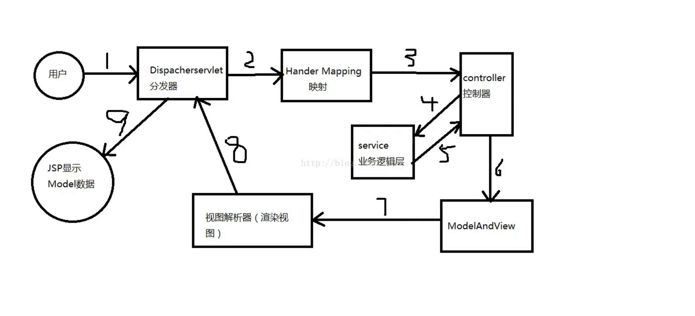

SSM框架是包含spring MVC，spring和 mybatis 框架的整合，标准的MVC模式。

将系统分为：View层、controller层、service层和DAO层。

spring MVC：请求的转发和视图管理

1. 客户端发送请求到 DIspacherServlet（分发器）
2. 由DispacherServlet控制器查询 HanderMapping，找到处理请求的Controller
3. Controller调用业务逻辑处理，返回ModelAndView
4. DispacherServlet查询视图解析器，找到ModelAndView指定的视图
5. 视图负责显示到客户端

spring：实现业务对象管理

1. Ioc容器（控制转移、控制反转）：装载Bean，使用的时候不需要进行初始化（new），直接调用即可。
2. aop（切面）：面向切面、切入点的编程

mybatis：数据对象的持久化引擎

1. mybatis是对jdbc的封装，使得数据库操作变得透明。
2. mybatis围绕着 sqlSessionFactory 实例展开
3. 通过配置文件关联到各个实体类的Mapper文件，Mapper文件中配置了每个类对数据库所需的sql语句映射
4. 每次与数据库进行交互时，通过sqlSessionFactory拿到一个sqlSession，在执行sql命令

#### 使用方法：

要完成一个功能：

1. 先写实体类entity，定义对象的属性，（可以参照数据库中表的字段来设置，数据库的设计应该在所有编码开始之前）。
2. 写Mapper.xml（Mybatis），其中定义你的功能，对应要对数据库进行的那些操作，比如 insert、selectAll、selectByKey、delete、update等。
3. 写Mapper.java，将Mapper.xml中的操作按照id映射成Java函数。
4. 写Service.java，为控制层提供服务，接受控制层的参数，完成相应的功能，并返回给控制层。
5. 写Controller.java，连接页面请求和服务层，获取页面请求的参数，通过自动装配，映射不同的URL到相应的处理函数，并获取参数，对参数进行处理，之后传给服务层。
6. 写JSP页面调用，请求哪些参数，需要获取什么数据。

DataBase ===> Entity ===> Mapper.xml ===> Mapper.Java ===> Service.java ===> Controller.java ===> Jsp.

