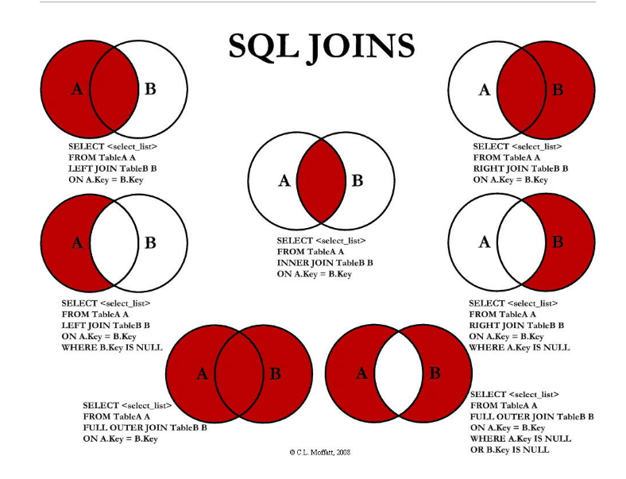

---

typora-copy-images-to: ./
---

#### RDBMS即关系数据库管理系统(Relational Database Management System)的特点：

- 数据以表格的形式出现
- 每行为各种记录名称
- 每列为记录名称所对应的数据域
- 许多的行和列组成一张表单
- 若干的表单组成database


####数据库的名词解释


- **数据库:** 数据库是一些关联表的集合。.
- **数据表:** 表是数据的矩阵。在一个数据库中的表看起来像一个简单的电子表格。
- **列:** 一列(数据元素) 包含了相同的数据, 例如邮政编码的数据。
- **行：**一行（=元组，或记录）是一组相关的数据，例如一条用户订阅的数据。
- **冗余**：存储两倍数据，冗余可以使系统速度更快。
- **主键**：主键是唯一的。一个数据表中只能包含一个主键。你可以使用主键来查询数据。
- **外键：**外键用于关联两个表。
- **复合键**：复合键（组合键）将多个列作为一个索引键，一般用于复合索引。
- **索引：**使用索引可快速访问数据库表中的特定信息。索引是对数据库表中一列或多列的值进行排序的一种结构。类似于书籍的目录。
- **参照完整性:** 参照的完整性要求关系中不允许引用不存在的实体。与实体完整性是关系模型必须满足的完整性约束条件，目的是保证数据的一致性

#### 管理的命令：

- show databases：列出数据库schema列表
- show tables：显示指定schema的所有表
- show columns from table：显示数据表中所有属性、属性类型、主键信息等
- show index from table：显示数据表的详细索引信息
- show table status like [table] \G：显示数据库管理系统的性能及统计信息
- show create table (table_name) \G：显示数据表的完整结构

```
mysql> SHOW TABLE STATUS  FROM W3CSCHOOL;   # 显示数据库 W3CSCHOOL 中所有表的信息
mysql> SHOW TABLE STATUS from W3CSCHOOL LIKE 'W3Cschool%';     # 表名以W3Cschool开头的表的信息
mysql> SHOW TABLE STATUS from W3CSCHOOL LIKE 'W3Cschool%'\G;   # 加上 \G，查询结果按列打印
```

#### [MySQL数据类型](https://www.w3cschool.cn/mysql/mysql-data-types.html)

大致可以分为三类：数值、日期/时间和字符串(字符)类型

##### 连接：

- **INNER JOIN（内连接,或等值连接）**：获取两个表中字段匹配关系的记录。
- **LEFT JOIN（左连接）：**获取左表所有记录，即使右表没有对应匹配的记录。
- **RIGHT JOIN（右连接）：** 与 LEFT JOIN 相反，用于获取右表所有记录，即使左表没有对应匹配的记录。




### 事务

事务是必须满足4个条件（ACID）： Atomicity（原子性）、Consistency（稳定性）、Isolation（隔离性）、Durability（可靠性）

- **事务的原子性：**一组事务，要么成功；要么撤回。
- **稳定性** ： 有非法数据（外键约束之类），事务撤回。
- **隔离性：**事务独立运行。一个事务处理后的结果，影响了其他事务，那么其他事务会撤回。事务的100%隔离，需要牺牲速度。
- **可靠性：**软、硬件崩溃后，InnoDB数据表驱动会利用日志文件重构修改。可靠性和高速度不可兼得， innodb_flush_log_at_trx_commit选项 决定什么时候把事务保存到日志里。

### 索引

- 单列索引：一个索引只包含单个列，一个表可以有多个单列索引
- 组合索引：一个索引包含多个列

索引大大提高了查询速度，但是降低了更新表的速度

### 复制表

- 从table2中查询到的结果插入到 table1中

```
insert into table1(columns1, columns2) select columns1, columns2 from table2;
```

- 创建一个表结构与table2一模一样的表，只复制结构不复制数据； 

```
create table table1 as select  * from table2  where 1=2; 
```

- 创建一个表结构与table2一模一样的表,复制结构同时也复制数据； 

```
create  table table1  as  select *   from table2  ; 
```

- 创建一个表结构与table2一模一样的表,复制结构同时也复制数据,但是指定新表的列名；

```
create  table table1(columns1,columns2) as select  columns1,columns2  from table2;  
```

***注意：***table () as select 命令复制表会出现不能复制默认值的情况

### SQL注入

1. 不要相信用户的输入。对用户的输入进行校验，可以通过正则表达式、限制长度对单双引号等敏感字符进行转换；

   ```
   addcslashes(string,characters)/*在指定的字符前添加反斜杠*/
   ```


2. 不要使用动态拼装sql，可以使用参数化的sql或者直接使用存储过程进行数据查询存取；
3. 不要使用管理员权限的数据库连接
4. 不要直接存储机密信息，加密或者hash掉密码；
5. 应用的异常信息应该给出尽可能少的提示，最好使用自定义的错误信息对原始错误信息进行包装；
6. 使用sql注入检测工具

### 导出数据

- 将数据表 w3cschool_tbl 数据导出到 /tmp/tutorials.txt 文件中

```
mysql> SELECT * (FROM passwd )
	-> INTO OUTFILE '/tmp/tutorials.txt'
    -> FIELDS TERMINATED BY ',' ENCLOSED BY '"' //使用“，”分割，用“ " ”双引号包围
    -> LINES TERMINATED BY '\r\n' //每行用“\r回车”、“\n换行”分割
    -> FROM test_table;
```

- 使用mysqldump 程序导出数据，它主要产生一个SQL脚本，其中包含从头重新创建数据库所必需的命令CREATE TABLE INSERT等

```
//使用‘--tab’选项来指定导出文件指定的目录，该目标必须是可写的
$ mysqldump -u root -p --no-create-info \
            --tab=/tmp W3CSCHOOL w3cschool_tbl
password ******
//导出SQL格式的数据到指定文件
$ mysqldump -u root -p W3CSCHOOL w3cschool_tbl > dump.txt
password ******

//导出整个数据库的数据
$ mysqldump -u root -p W3CSCHOOL > database_dump.txt
password ******

//备份所有数据库
$ mysqldump -u root -p --all-databases > database_dump.txt
password ******
```

- 拷贝至其他主机

```
$ mysqldump -u root -p database_name \
       | mysql -h other-host.com database_name
```

### 导入数据

LOAD DATA INFILE是SELECT ... INTO OUTFILE的逆操作，SELECT句法。为了将一个数据库的数据写入一个文件，使用SELECT ... INTO OUTFILE，为了将文件读回数据库，使用LOAD DATA INFILE。

- 从当前目录中读取文件 dump.txt ，将该文件中的数据插入到当前数据库的 mytbl 表中

```
mysql> LOAD DATA LOCAL INFILE 'dump.txt' INTO TABLE mytbl (b, c, a)
    -> FIELDS TERMINATED BY ':'
    -> LINES TERMINATED BY '\r\n';
```

***注意：***

1. 如果指定LOCAL关键词，则表明从客户主机上按路径读取文件。如果没有指定，则文件在服务器上按路径读取文件。
2. 两个命令的 FIELDS 和 LINES 子句的语法是一样的。两个子句都是可选的，但是如果两个同时被指定，FIELDS 子句必须出现在 LINES 子句之前。
3. 如果用户指定一个 FIELDS 子句，它的子句 （TERMINATED BY、[OPTIONALLY] ENCLOSED BY 和 ESCAPED BY) 也是可选的，不过，用户必须至少指定它们中的一个。
4. 默认情况下是按照数据文件中列的顺序插入数据的，如果数据文件中的列与插入表中的列不一致，则需要指定列的顺序。在数据文件中的列顺序是 a,b,c，但在插入表的列顺序为b,c,a。

- 使用 mysqlimport 导入数据

```
//从文件 dump.txt 中将数据导入到 mytbl 数据表中
$ mysqlimport -u root -p --local database_name dump.txt
password *****

//mysqlimport命令可以指定选项来设置指定格式
$ mysqlimport -u root -p --local --fields-terminated-by=":" \
   --lines-terminated-by="\r\n"  database_name dump.txt
password *****

//mysqlimport 语句中使用 --columns 选项来设置列的顺序
$ mysqlimport -u root -p --local --columns=b,c,a \
    database_name dump.txt
password *****
```

### 分页查询

- 数据库会完整扫描 offset 的行，然后继续扫描 rows 行之后才把结果集返回。性能比较差

```
SELECT * FROM table LIMIT [offset,] rows | rows OFFSET offset
```

- 使用 id 限定优化。要了解id的分布情况

```
select * from orders_history where type=2 
and id between minid and maxid limit 100;
```

- 使用子查询优化

```
select * from table where id >= #minId# and xxx in (1,2,3) limit 200

select * from orders_history where id in
(select order_id from trade_2 where goods = 'pen')
limit 100;
```

#实际操作


```
$> /etc/my.cnf
skip-grant-tables=1 //可以不用权限就可以封路
修改密码经常失败，需要将原来的账户删除，重新创建，刷新权限
mysql>flush privileges;
mysql>ALTER USER 'root'@'localhost'IDENTIFIED BY '********'
mysql>update user set authentication_string=password('root') where user='root' ;
```

