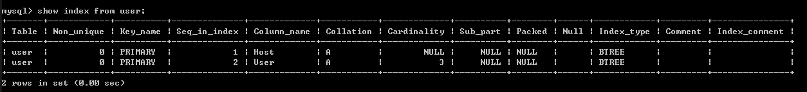

定义：

主键：唯一标识一条记录，不能有重复的，不允许为空

外键：表的外键是另一表的主键, 外键可以有重复的, 可以是空值

索引：是对数据库表中一列或多列的值进行排序的一种结构

作用：

主键：用来保证数据完整性

外键：用来和其他表建立联系用的

索引：是提高查询排序的速度

个数：

主键：主键只能有一个（但是可以使用多个列组合成**复合主键**）

外键：一个表可以有多个外键

索引：一个表可以有多个唯一索引

添加：

主键：ALTER TABLE “表名” ADD PRIMARY KEY (字段名)

外键：ALTER TABLE “表名” ADD FOREIGN KEY (字段名) REFERENCES “另一张表名”( 字段名)

索引：ALTER TABLE “表名” ADD INDEX (字段名)

