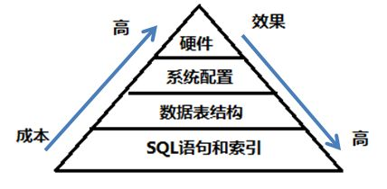

### 数据库优化四大阶段

- SQL语句以及索引优化

SQL以及索引的优化是最重要的。首先要根据需求写出**结构良好**的SQL，然后根据SQL在表中建立**有效的**索引。但是如果索引太多，不但会影响写入的效率，对查询也有一定的影响。

- 数据库表结构的优化

要根据一些范式来进行表结构的设计。设计表结构时，就需要考虑如何设计才能够更有效的查询。

- 系统配置优化

系统配置的优化。MySQL数据库是基于文件的，如果打开的文件数达到一定的数量，无法打开之后就会进行频繁的IO操作。

- 硬件优化

更快的IO、更多的内存。一般来说内存越大，对于数据库的操作越好。但是**CPU多就不一定了，因为他并不会用到太多的CPU数量，有很多的查询都是单CPU**。另外使用高的IO（SSD、RAID），但是IO并不能减少数据库锁的机制。所以说如果查询缓慢是因为数据库内部的一些锁引起的，那么硬件优化就没有什么意义。

