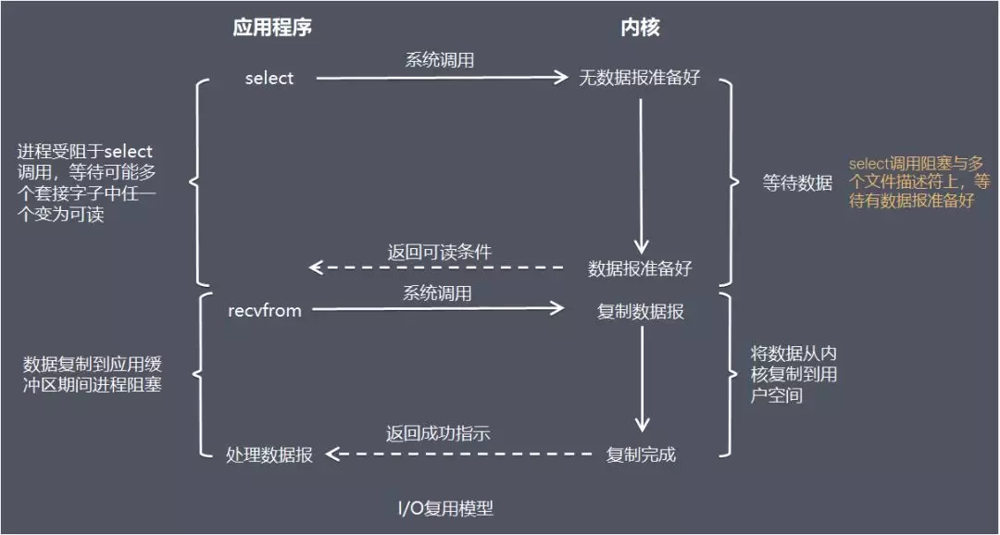
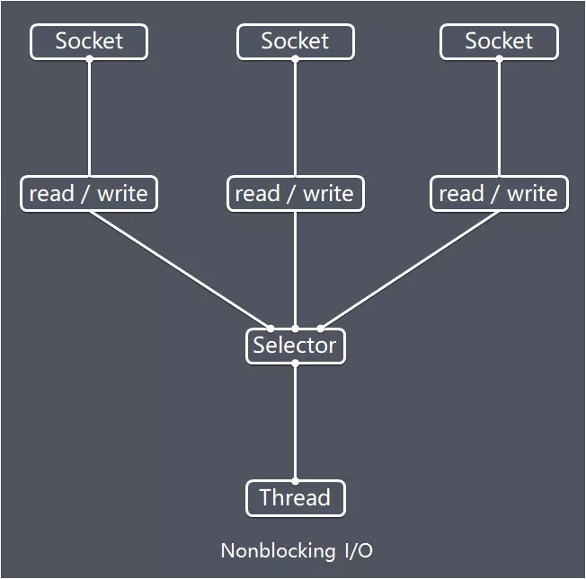
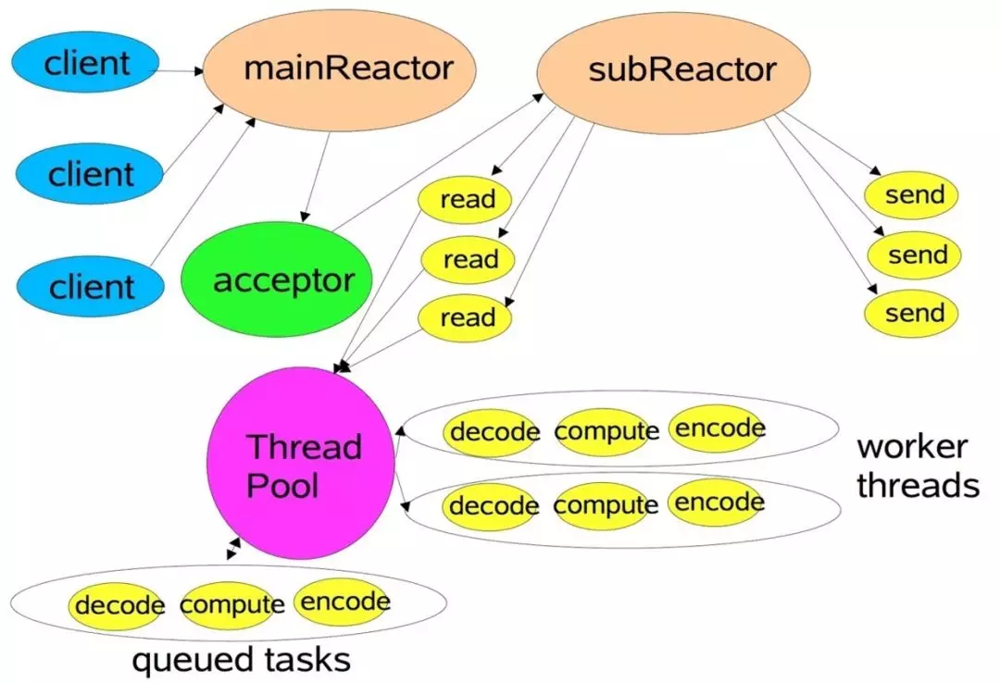
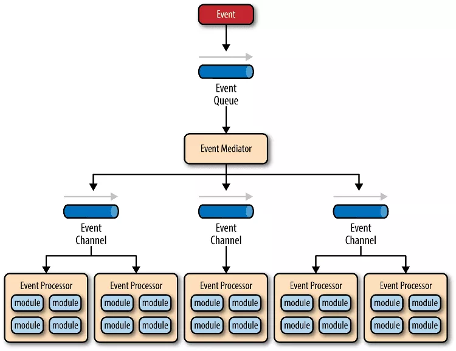
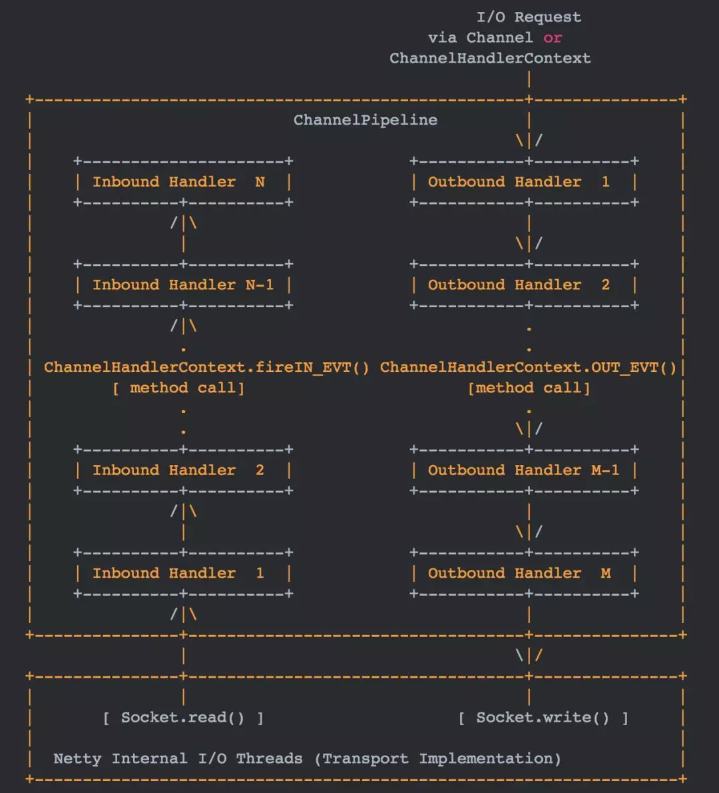
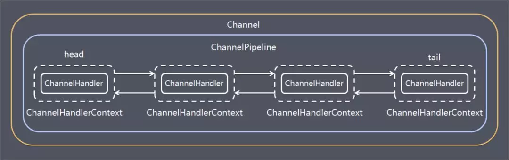
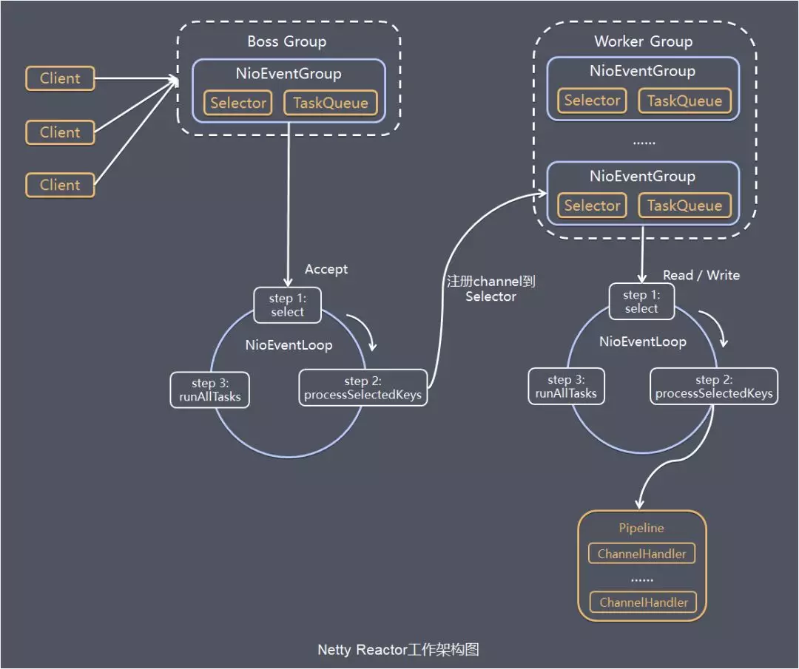

[原文](https://mp.weixin.qq.com/s?__biz=MzIxNjA5MTM2MA==&mid=2652435160&idx=1&sn=08a3757772e2edcedbd207d04ae21e22&chksm=8c620d57bb158441aa2b81587b67ba446ae3b17599b213f2d985914584d98aee3bac7844ab04&scene=0&xtrack=1#rd)

### JDK原生API问题

JDK原生也有一套网络应用程序API，但是存在一系列问题，主要如下：

- NIO的类库和API繁杂，使用麻烦，你需要熟练掌握Selector、ServerSocketChannel、SocketChannel、ByteBuffer等
- 需要具备其它的额外技能做铺垫，例如熟悉Java多线程编程，因为NIO编程涉及到Reactor模式，你必须对多线程和网路编程非常熟悉，才能编写出高质量的NIO程序
- 可靠性能力补齐，开发工作量和难度都非常大。例如客户端面临断连重连、网络闪断、半包读写、失败缓存、网络拥塞和异常码流的处理等等，NIO编程的特点是功能开发相对容易，但是可靠性能力补齐工作量和难度都非常大
- JDK NIO的BUG，例如臭名昭著的epoll bug，它会导致Selector空轮询，最终导致CPU 100%。官方声称在JDK1.6版本的update18修复了该问题，但是直到JDK1.7版本该问题仍旧存在，只不过该bug发生概率降低了一些而已，它并没有被根本解决（这个bug具体就是本来应该阻塞的select() 方法，在网络情况波动或者其他情况下，linux的kernel会令select() 返回，就会进入死循环。NIO框架的解决方法是计算循环次数，达到一定次数之后将selector注册的key转移到新的selector中）

#### 源码

```
int select(int nfds, fd_set *readfds, fd_set *writefds, fd_set *exceptfds, struct timeval *timeout);

int poll(struct pollfd *fds, nfds_t nfds, int timeout);

int epfd = epoll_create(10);
int epoll_ctl(int epfd, int op, int fd, struct epoll_event *event);
```


### IO模型



在I/O复用模型中，会用到select，这个函数也会使进程阻塞，但是和阻塞I/O所不同的的，这两个函数可以同时阻塞多个I/O操作，而且可以同时对多个读操作，多个写操作的I/O函数进行检测，直到有数据可读或可写时，才真正调用I/O操作函数.

#### Netty使用的IO模型



### Reactor线程模型

Reactor是反应堆的意思，Reactor模型，是指通过一个或多个输入同时传递给服务处理器的服务请求的**事件驱动处理模式**。

Reactor指的是服务器处理请求时，将所有请求用Reactor(反应堆)接收，然后将请求分发到handlers（处理器）来进行处理。

另外Netty中使用的是**主从Reactor**。


**主从Reactor**多线程模型有多个Reactor：MainReactor和SubReactor：

- MainReactor负责客户端的连接请求，并将请求转交给SubReactor
- SubReactor负责相应通道的IO读写请求
- 非IO请求（具体逻辑处理）的任务则会直接写入队列，等待worker threads进行处理



**事件驱动模型**

发生事件，主线程把事件放入事件队列，在另外线程不断循环消费事件列表中的事件，调用事件对应的处理逻辑处理事件。事件驱动方式也被称为消息通知方式，其实是设计模式中**观察者模式**的思路。

主要包括4个基本组件：

- 事件队列（event queue）：接收事件的入口，存储待处理事件
- 分发器（event mediator）：将不同的事件分发到不同的业务逻辑单元
- 事件通道（event channel）：分发器与处理器之间的联系渠道
- 事件处理器（event processor）：实现业务逻辑，处理完成后会发出事件，触发下一步操作



### 功能特性

- 传输服务
  支持BIO和NIO
- 容器集成
  支持OSGI、JBossMC、Spring、Guice容器
- 协议支持
  HTTP、Protobuf、二进制、文本、WebSocket等一系列常见协议都支持。
  还支持通过实行编码解码逻辑来实现自定义协议
- Core核心
  可扩展事件模型、通用通信API、支持零拷贝的ByteBuf缓冲对象

### 模块

#### **Bootstrap、ServerBootstrap**

Bootstrap意思是引导，一个Netty应用通常由一个Bootstrap开始，主要作用是配置整个Netty程序，串联各个组件，Netty中Bootstrap类是客户端程序的启动引导类，ServerBootstrap是服务端启动引导类。

####**Future、ChannelFuture**

正如前面介绍，在Netty中所有的IO操作都是异步的，不能立刻得知消息是否被正确处理，但是可以过一会等它执行完成或者直接注册一个监听，具体的实现就是通过Future和ChannelFutures，他们可以注册一个监听，当操作执行成功或失败时监听会自动触发注册的监听事件。

#### **Channel**

Netty网络通信的组件，能够用于执行网络I/O操作。
Channel为用户提供：

- 当前网络连接的通道的状态（例如是否打开？是否已连接？）

- 网络连接的配置参数 （例如接收缓冲区大小）

- 提供异步的网络I/O操作(如建立连接，读写，绑定端口)，异步调用意味着任何I / O调用都将立即返回，并且不保证在调用结束时所请求的I / O操作已完成。调用立即返回一个ChannelFuture实例，通过注册监听器到ChannelFuture上，可以I / O操作成功、失败或取消时回调通知调用方。

- 支持关联I/O操作与对应的处理程序

  不同协议、不同的阻塞类型的连接都有不同的 Channel 类型与之对应，下面是一些常用的 Channel 类型

- NioSocketChannel，异步的客户端 TCP Socket 连接

- NioServerSocketChannel，异步的服务器端 TCP Socket 连接

- NioDatagramChannel，异步的 UDP 连接

- NioSctpChannel，异步的客户端 Sctp 连接

- NioSctpServerChannel，异步的 Sctp 服务器端连接

这些通道涵盖了 UDP 和 TCP网络 IO以及文件 IO.

#### **Selector**

Netty基于Selector对象实现I/O多路复用，通过 Selector, 一个线程可以监听多个连接的Channel事件, 当向一个Selector中注册Channel 后，Selector 内部的机制就可以自动不断地查询(select) 这些注册的Channel是否有已就绪的I/O事件(例如可读, 可写, 网络连接完成等)，这样程序就可以很简单地使用一个线程高效地管理多个 Channel 。

#### **NioEventLoop**

NioEventLoop中维护了一个线程和任务队列，支持异步提交执行任务，线程启动时会调用NioEventLoop的run方法，执行I/O任务和非I/O任务：

- I/O任务
  即selectionKey中ready的事件，如accept、connect、read、write等，由processSelectedKeys方法触发。
- 非IO任务
  添加到taskQueue中的任务，如register0、bind0等任务，由runAllTasks方法触发。

两种任务的执行时间比由变量ioRatio控制，默认为50，则表示允许非IO任务执行的时间与IO任务的执行时间相等。

#### **NioEventLoopGroup**

NioEventLoopGroup，主要管理eventLoop的生命周期，可以理解为一个线程池，内部维护了一组线程，每个线程(NioEventLoop)负责处理多个Channel上的事件，而一个Channel只对应于一个线程。

#### **ChannelHandler**

ChannelHandler是一个接口，处理I / O事件或拦截I / O操作，并将其转发到其ChannelPipeline(业务处理链)中的下一个处理程序。

ChannelHandler本身并没有提供很多方法，因为这个接口有许多的方法需要实现，方便使用期间，可以继承它的子类：

- ChannelInboundHandler用于处理入站I / O事件
- ChannelOutboundHandler用于处理出站I / O操作

或者使用以下适配器类：

- ChannelInboundHandlerAdapter用于处理入站I / O事件

- ChannelOutboundHandlerAdapter用于处理出站I / O操作

- ChannelDuplexHandler用于处理入站和出站事件


#### **ChannelHandlerContext**

保存Channel相关的所有上下文信息，同时关联一个ChannelHandler对象

#### **ChannelPipline**

保存ChannelHandler的List，用于处理或拦截Channel的入站事件和出站操作。 ChannelPipeline实现了一种高级形式的拦截过滤器模式，使用户可以完全控制事件的处理方式，以及Channel中各个的ChannelHandler如何相互交互。

下图引用Netty的Javadoc4.1中ChannelPipline的说明，描述了ChannelPipeline中ChannelHandler通常如何处理I/O事件。 I/O事件由ChannelInboundHandler或ChannelOutboundHandler处理，并通过调用ChannelHandlerContext中定义的事件传播方法（例如ChannelHandlerContext.fireChannelRead（Object）和ChannelOutboundInvoker.write（Object））转发到其最近的处理程序。



入站事件由自下而上方向的入站处理程序处理，如图左侧所示。 入站Handler处理程序通常处理由图底部的I / O线程生成的入站数据。 通常通过实际输入操作（例如SocketChannel.read（ByteBuffer））从远程读取入站数据。

出站事件由上下方向处理，如图右侧所示。 出站Handler处理程序通常会生成或转换出站传输，例如write请求。 I/O线程通常执行实际的输出操作，例如SocketChannel.write（ByteBuffer）。

在 Netty 中每个 Channel 都有且仅有一个 ChannelPipeline 与之对应, 它们的组成关系如下:



一个 Channel 包含了一个 ChannelPipeline, 而 ChannelPipeline 中又维护了一个由 ChannelHandlerContext 组成的双向链表, 并且每个 ChannelHandlerContext 中又关联着一个 ChannelHandler。入站事件和出站事件在一个双向链表中，入站事件会从链表head往后传递到最后一个入站的handler，出站事件会从链表tail往前传递到最前一个出站的handler，两种类型的handler互不干扰。

### 服务器启动代码

```
public static void main(String[] args) {
       // 创建mainReactor
       NioEventLoopGroup boosGroup = new NioEventLoopGroup();
       // 创建工作线程组
       NioEventLoopGroup workerGroup = new NioEventLoopGroup();

       final ServerBootstrap serverBootstrap = new ServerBootstrap();
       serverBootstrap 
                // 组装NioEventLoopGroup 
               .group(boosGroup, workerGroup)
                // 设置channel类型为NIO类型
               .channel(NioServerSocketChannel.class)
               // 设置连接配置参数
               .option(ChannelOption.SO_BACKLOG, 1024)
               .childOption(ChannelOption.SO_KEEPALIVE, true)
               .childOption(ChannelOption.TCP_NODELAY, true)
               // 配置入站、出站事件handler
               .childHandler(new ChannelInitializer<NioSocketChannel>() {
                   @Override
                   protected void initChannel(NioSocketChannel ch) {
                       // 配置入站、出站事件channel
                       ch.pipeline().addLast(...);
                       ch.pipeline().addLast(...);
                   }
   });

       // 绑定端口
       int port = 8080;
       serverBootstrap.bind(port).addListener(future -> {
           if (future.isSuccess()) {
               System.out.println(new Date() + ": 端口[" + port + "]绑定成功!");
           } else {
               System.err.println("端口[" + port + "]绑定失败!");
           }
       });
}
```

### 工作架构




server端包含1个Boss NioEventLoopGroup和1个Worker NioEventLoopGroup，NioEventLoopGroup相当于1个事件循环组，这个组里包含多个事件循环NioEventLoop，每个NioEventLoop包含1个selector和1个事件循环线程。

每个Boss NioEventLoop循环执行的任务包含3步：

1. 轮询accept事件
2. 处理accept I/O事件，与Client建立连接，生成NioSocketChannel，并将NioSocketChannel注册到某个Worker NioEventLoop的Selector上
3.  处理任务队列中的任务，runAllTasks。任务队列中的任务包括用户调用eventloop.execute或schedule执行的任务，或者其它线程提交到该eventloop的任务。

每个Worker NioEventLoop循环执行的任务包含3步：

1. 轮询read、write事件；
2. 处I/O事件，即read、write事件，在NioSocketChannel可读、可写事件发生时进行处理
3. 处理任务队列中的任务，runAllTasks。

### 使用Netty实现IO和NIO

```
public class NettyServer {

    public void server(int port) throws Exception {
        final ByteBuf buf = Unpooled.unreleasableBuffer(
                Unpooled.copiedBuffer("Hi!\r\n", Charset.forName("UTF-8")));
        EventLoopGroup group = new OioEventLoopGroup();
        //EventLoopGroup group = new NioEventLoopGroup();
        try {
            ServerBootstrap b = new ServerBootstrap();        //1

            b.group(group)                                    //2
             .channel(OioServerSocketChannel.class)
             //.channel(NioServerSocketChannel.class)
             .localAddress(new InetSocketAddress(port))
             .childHandler(new ChannelInitializer<SocketChannel>() {//3
                 @Override
                 public void initChannel(SocketChannel ch) 
                     throws Exception {
                     ch.pipeline().addLast(new ChannelInboundHandlerAdapter() {            //4
                         @Override
                         public void channelActive(ChannelHandlerContext ctx) throws Exception {
                             ctx.writeAndFlush(buf.duplicate()).addListener(ChannelFutureListener.CLOSE);//5
                         }
                     });
                 }
             });
            ChannelFuture f = b.bind().sync();  //6
            f.channel().closeFuture().sync();
        } finally {
            group.shutdownGracefully().sync();        //7
        }
    }
}
```

