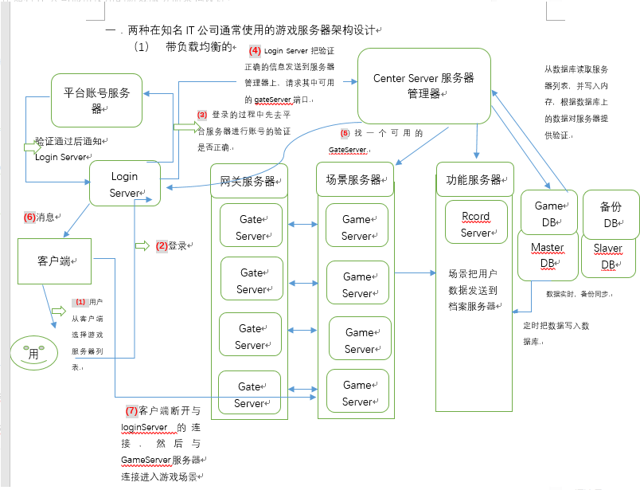

各个服务器的功能以及作用

-  CenterServer服务器管理器

管理所有的服务器，分配服务器的端口，负责全局的逻辑（管理），对各功能服务器

和场景服务器提供服务，保证服务器的合法性

-  DBserver

角色档案缓冲服务器

-   GameServer

逻辑服务器，玩家的实时同步在里面实现

-  GateServer

网关服务器，负责消息转发

- LoginServer登录服务器

连接账号数据

带负载均衡的（与带负载均衡大概的架构相同）

不同点：

-   不带负载均衡

1.   Gate Server 和Game Server之间是一对一的关系，每个Game Server能容纳的玩家数量是一定的，正常情况下一个Gate Server的对应一个Game Server实时在线人数能达到3000人，一旦达到峰值，就会找下一个对应的Game Server
2.   各个Gate Server服务器之间是不通信的

- 带负载均衡

1.  一个Gate Server的对应多个Game Server
2.  各个GateServer之间可以互相通信，而且还可以随意扩展，通过配置文件可以实现配置

服务器的工作过程：

1)     用户从客户端选择游戏服务器列表

2)     登录到Login Server,在登陆的过程中

3)     先去平台服务器进行账号的验证

4)     验证通过后会通知Login Server，然后Login Server会把验证的消息发送到center Server，请求其中的Gate Server的地址和端口

5)     Center Server会找一个可用的Gate Server信息,发送回LoginServer

6)     Login Server会把消息发送给客户端

7)     客户端断开与Login Server的连接，然后与Game Server 连接进入游戏场景中