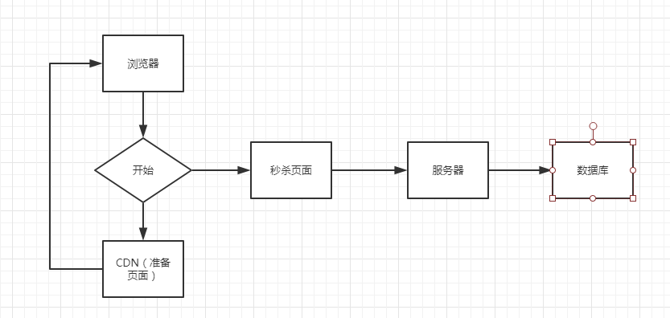
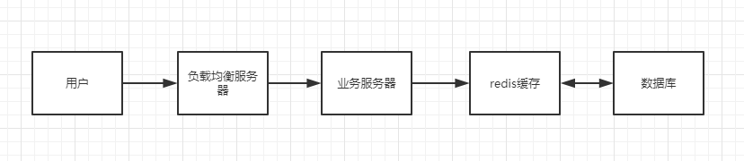

### 业务分析

秒杀活动是指在指定时间开发给用户的限量购买活动，主要特点：

- 瞬时流量大
- 请求多
- 只有一部分用户能购买成功，大部分人购买是不成功的。（数据库读多写少）
- 判断库存或者能否购买需要数据的一致性

### 活动流程分析

1. 活动开始前

用户：不停刷新页面等待活动开始

程序员：

- 用户刷新的页面都是一样的，因此将页面静态储存在CDN里，直接返回静态的页面
- 将购买按钮设置成不可点击状态
- 部分高手可以在js文件中修改按钮状态，甚至是得到购买的连接越过前端直接购买，因此需要为购买链接进行加密，例如说：
  - 购买链接后面添加随机字符，该字符在活动开始的时候才会进行分配给用户
  - 增加活动门槛，在商品页面为用户进行校验，防止“僵尸”脚本大量请求

2. 活动进行中

用户：大量用户同时发送请求，此时是服务器的瓶颈期。扛不住数据就崩了

3. 活动结束

将活动状态设置为结束，用户访问页面就返回活动结束页面

### 后端开发层次分析

1. 负载均衡

用户发送请求经过负载均衡站点服务器，过滤不符合要求的请求信息，减轻后续服务器的负担；

将页面存放在站点服务器中，减少动态生成页面的流量

2. 业务服务器

请求发送服务器，开始处理业务。业务需要足够精巧，复杂的业务会严重加重在高并发环境下的处理时间。

3. 缓存

在初次访问数据库的时候首先查看缓存中是否已经存在，如果缓存命中则直接从缓存里去数据；如果没有命中则对数据库取数据，放到缓存中再返回数据。

4. 数据库

数据的读写情况是“读多写少”，采用乐观锁可以有效地提高效率

