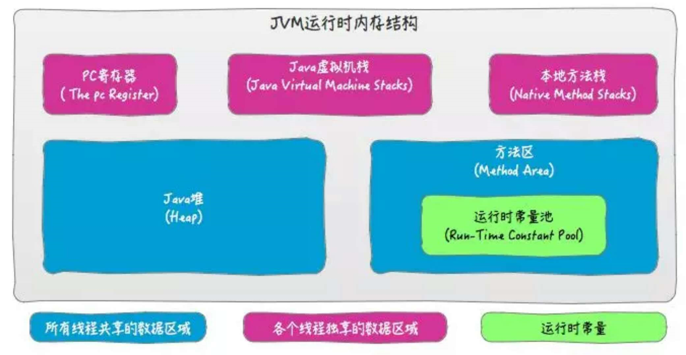
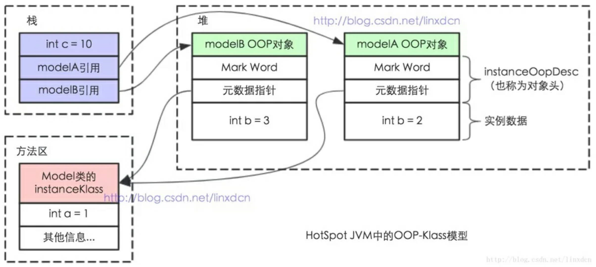

### JVM内存结构

由java虚拟机规范定义。描述的是java程序执行过程中，由JVM管理的不同内存区域。各个区域都有各自的作用。

### Java内存模型（JMM）

在java内存结构中，堆和方法区是属于所有线程共享的数据区域，这也就是“Java线程间通过内存共享进行通信”。

在JMM中把多个线程共享的内存区域称为**主内存**，并在多并发编程中多个线程都维护了一个自己的本地内存（这是抽象的概念）其中保存的是主内存中的数据拷贝。

而JMM的主要目的是控制本地内存和主内存之间的数据交互的。

### Java对象模型

关于Java对象自身的存储模型称为Java对象模型。

在HotSpot虚拟机中，设计了一个OOP-Klass Model。OOP（ordinary object pointer）普通对象指针，Klass描述对象实例的具体类型。

每一个Java类，在加载的时候，会自动创建一个instanceKlass，保存在方法区，以在JVM层表示Java类。

在代码中new一个java对象时，JVM创建一个instanceOopDesc对象，这个对象包含了对象头和实例数据。

### 总结

- JVM内存结构，和java虚拟机的运行时区域有关。
- Java内存模型，和并发编程有关。
- Java对象模型， 和Java对象在虚拟机中表现形式有关。

