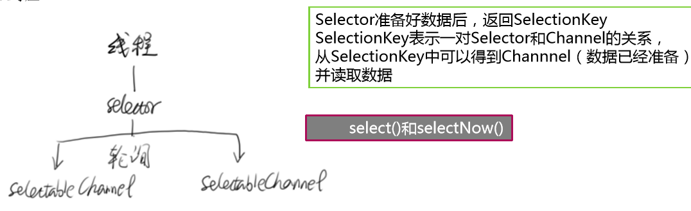

#### 区分网络IO与磁盘IO

在网络IO中，read、write等操作会因为数据没有就绪而进入“Blocking”，但是对于磁盘IO来说，不会进入Block。

所以现如今讨论的IO优化多是网络IO。

### BIO（Blocking IO）

在类似于网络中进行read, write, connect一类的系统调用时会被卡住。

举个例子，当用read去读取网络的数据时，是无法预知对方是否已经发送数据的。因此在收到数据之前，能做的只有等待，直到对方把数据发过来，或者等到网络超时。

对于单线程的网络服务，这样做就会有卡死的问题。因为当等待时，整个线程会被挂起，无法执行，也无法做其他的工作。

<!--此处的挂起指的是当前进程被挂起，不影响其他程序的运行-->

### NIO（No-Blocking IO）

在BIO中，调用read，如果发现没有数据到达，就会Block；

在NIO中，如果没有数据到达，会立刻返回-1，并将errno设置EAGAIN/EWOULDBLOCK。表示等一下在进行尝试，加入轮询队列

##### NIO新问题

1. 在轮询中会频繁切换线程，导致Context Switch。每次切换都会在用户态和核心态切换一次。
2. 停顿时间设置，不合理的停顿时间会影响系统性能。

##### IO多路复用

多个socket共用线程，监听每个socket的事件，使用select进行选择

1. 得到Channel

2. 申请Buffer

3. 建立Channel和Buffer的读/写关系

4. 关闭

###### 核心组件

- Buffers（缓冲区）

- Selectors（选择器）
- Channels（通道）

一个Channel可以和文件或者网络Socket对应 。

