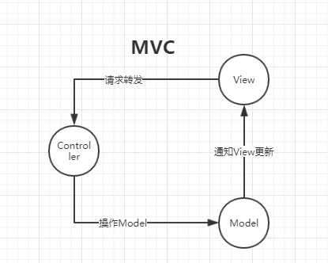
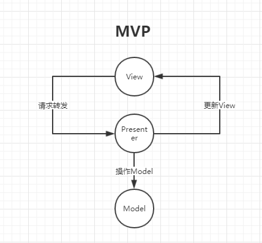
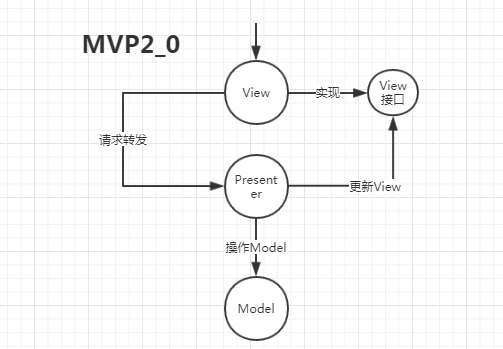
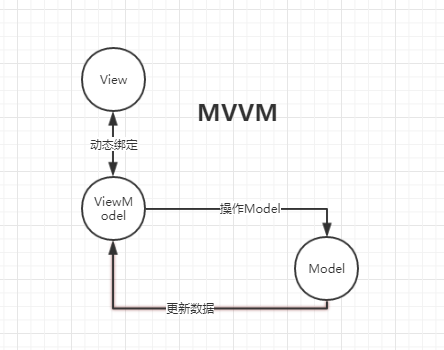

**MVC**

M：Model，用来处理业务逻辑

V：View，专注页面布局和数据显示

C：Controller， 翻译用户的输入，操作模型和视图

缺点：

- 依赖太多
  - View依赖Controller和Model
  - Controller依赖View和Model

**MVP**

但是Presenter还是对View有依赖，然后出现MVP2.0

**MVVM**

告诉View一个数据结构，View根据这个数据结构的变化而变化。

ViewModel：与View绑定

