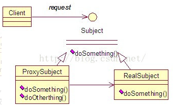
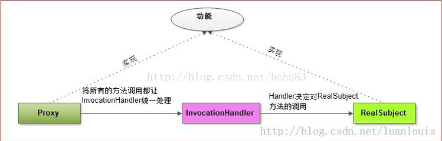

	[Demo](https://blog.csdn.net/mine_song/article/details/71373305)

某个对象提供一个代理，以控制对这个对象的访问。 代理类和委托类有共同的父类或父接口，这样在任何使用委托类对象的地方都可以用代理对象替代。代理类负责请求的预处理、过滤、将请求分派给委托类处理、以及委托类执行完请求后的后续处理。   

### 静态代理

- 在程序运行前，它的.class文件就已经存在了。

由程序员创建或工具生成代理类的源码，再编译代理类。所谓静态也就是在程序运行前就已经存在代理类的字节码文件，代理类和委托类的关系在运行前就确定了。 

### 动态代理

- 动态代理类的字节码在程序运行时由Java反射机制动态生成，无需程序员手工编写它的源代码。动态代理类不仅简化了编程工作，而且提高了软件系统的可扩展性，因为Java反射机制可以生成任意类型的动态代理类。java.lang.reflect 包中的Proxy类和InvocationHandler接口提供了生成动态代理类的能力。

在调用某个方法前及方法后做一些额外的业务。换一种思路就是：在触发（invoke）真实角色的方法之前或者之后做一些额外的业务。那么，为了构造出具有通用性和简单性的代理类，可以将所有的触发真实角色动作交给一个触发的管理器，让这个管理器统一地管理触发。这种管理器就是Invocation Handler。

以上是通过实现接口进行动态代理，还有一种是通过继承类来实现动态代理（cglib）

