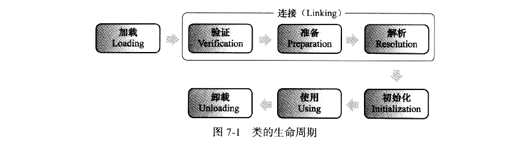
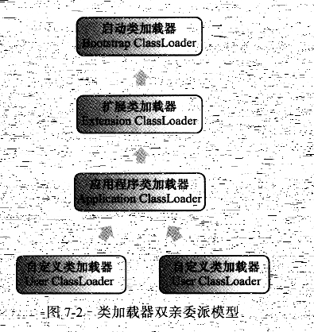

虚拟机把描述类的数据从class文件加载到内存，并对数据进行校验、转换解析和初始化，最终幸好曾可以被虚拟机直接使用的java类型，这就是虚拟机的类加载机制。

初始化的5种情况：

1. 遇到new、getstatic、putstatic或incokestatic这4条指令时，如果类没有进行过初始化，则需要先触发其初始化。
2. 使用java.lang.reflect包的方法对类进行反射调用的时候，如果类没有进行过初始化，则需要先触发其初始化。
3. 当初始化一个类的时候，如果其父类没有进行过初始化，则需要先触发其父类的初始化。
4. 当虚拟机启动时，用户需要指定一个要执行的主类，虚拟机会先初始化这个主类
5. 当使用JDK1.7的动态语言支持时，如果一个java.lang.invoke.MethodHandel实例最后的解析结果为REF_getStatic、REF_putStatic、REF_invokeStatic方法句柄，并且这个句柄对应的类没有进行过初始化，则需要先触发其初始化。

被动引用的3种情况

1. 通过子类引用父类的静态字段，不会导致子类初始化
2. 通过数组定义来引用类，不会触发此类的初始化
3. 常量在编译阶段会存入调用类的常量池中，本质上并没有直接引用到定义常量的类，因此不会触发定义常量的类的初始化。

# 类加载过程

### 加载

1. 通过一个类的全限定名来获取定义此类的二进制字节流
2. 将这个字节流所代表的静态存储结构转化为方法区的运行时数据结构
3. 在内存中生成一个代表这个类的java.lang.Class对象，作为方法区这个类的各种数据的访问入口

数组类本身不通过类加载器创建，是由java虚拟机直接创建的。但数组类的元素类型最终还是靠类加载器去创建。

### 验证

1. 文件格式验证

- 是否以魔数开头
- 主、次版本号
- 检查常量tag标志
- 指向常量废人各种索引值中是否有指向不存在的常量或不符合类型的常量
- CONSTANT_Utf8_info类型的常量中是否有不符合UTF8编码的数据
- class文件中各个部分及文件本身是否有被删除的或附加的其他信息

2. 元数据验证

- 是否有父类
- 父类是否继承了不允许继承的类
- 如果不是抽象类，是否实现了其父类或接口中要求实现的方法
- 类中的字段、方法是否与父类产生了矛盾

3. 字节码验证

通过数据流和控制流分析，确定程序语义是合法的、符合逻辑的。

这里有一点：通过程序去校验程序逻辑是无法做到绝对准确的——不能通过程序准确地检查出程序是否能在有限的时间内结束运行。

4. 符号引用验证

- 符号引用中通过字符串描述的全限定名是否能找到对应的类
- 在指定类中是否存在符合方法的字段描述符以及简单名称所描述的方法和字段
- 符号引用中的类、字段、方法的访问性是否可以被当前类访问

### 准备

准备阶段是正式为类变量分配内存并设置类变量初始值的阶段，这些变量使用的内存都在**方法区**中分配。（类变量仅仅包括static修饰的变量；初始值是零值）

### 解析

解析阶段是虚拟机将常量池内的符号引用替代为直接引用的过程。

1. 类或接口的解析
2. 字段解析

如果有一个同名字段同时出现在C的接口和父类中，或者同时在自己或父类的多个接口中出现，编译器将可能拒绝编译。

3. 类方法解析
4. 接口方法解析

### 初始化

根据程序员通过程序制定的主观计划去初始化类变量和其他资源，或者说初始化阶段是执行类构造器<clinit>()方法的过程。

- <clinit>()方法是由编译器自动收集类中的所有类变量的赋值动作和静态语句块中的语句合并产生的，编译器收集的顺序是由语句在源文件中出现的顺序决定的。
- 虚拟机保证在子类的<clinit>()方法执行之前，父类ude<clinit>()方法方法已经执行完毕。
- 由于父类的<clinit>()方法先执行，则父类中的静态语句块要先于子类的变量赋值操作。
- 如果一个类没有静态语句块，则可以不为这个类生成<clinit>()方法
- 接口不能使用静态语句块，但是也有<clinit>()方法。此时的<clinit>()方法不需要执行父接口的<clinit>()方法。
- 一个类的<clinit>()方法会在多线程环境中被正确地加锁、同步。

### 类加载器

把加载阶段的“通过一个类的全限定名来获取定义此类的二进制字节流”操作放到虚拟机外部实现，实现这个动作的代码模块成为“类加载器”。

**比较两个类是否相等**，只有在两个类是由同一个类加载器加载的前提下才有意义。

### 双亲委派模型

- 启动类加载器：使用C++实现，是虚拟机的一部分
- 所有其它的类加载器：由java语言实现，独立于虚拟机，并且全部继承自抽象类java.lang.ClassLoader

划分得更细致些可以分成三种：

1. 启动类加载器
2. 拓展类加载器
3. 应用程序类加载器（系统类加载器）

工作过程：如果一个类加载器收到了类加载的请求，首先把这个请求提交给父类加载器执行。只有当父加载器反馈自己无法完成请求时，子加载器才会尝试自己加载。

加载过程：

1.  检查是否已经被加载过
2. 若无，调用父加载器的加载方法
3. 若父加载器为空，使用启动类加载器作为父加载器