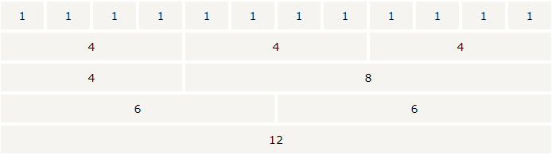

Bootstrap

[实战](https://www.w3cschool.cn/codecamp/list?pename=responsive_design_with_bootstrap_camp)

优点：

- 移动设备优先
- 浏览器支持
- 容易上手
- 响应式设计


#### Bootstrap 网格系统

Bootstrap 包含了一个**响应式**的、**移动设备优先**的、**不固定**的网格系统，可以随着设备或视口大小的增加而适当地扩展到 12 列。它包含了用于简单的布局选项的预定义类，也包含了用于生成更多语义布局的功能强大的混合类。



- 行必须放置在 **.container** class 内，以便获得适当的对齐（alignment）和内边距（padding）。
- 使用行来创建列的水平组。
- 内容应该放置在列内，且唯有列可以是行的直接子元素。
- 预定义的网格类，比如 **.row** 和 **.col-xs-4**，可用于快速创建网格布局。LESS 混合类可用于更多语义布局。
- 列通过内边距（padding）来创建列内容之间的间隙。该内边距是通过 **.rows** 上的外边距（margin）取负，表示第一列和最后一列的行偏移。
- 网格系统是通过指定您想要横跨的十二个可用的列来创建的。例如，要创建三个相等的列，则使用三个 **.col-xs-4**。

基本网格结构：

```
<div class="container">   
  <div class="row">      
    <div class="col-*-*"></div>      
    <div class="col-*-*"></div>  
    /*
    <div class="col-sm-3 col-md-6 col-lg-4">....</div>
	<div class="col-sm-9 col-md-6 col-lg-8">....</div>
	*/
  </div>   
  <div class="row">...</div>
  </div>
  <div class="container">....
```

#### 响应式的列重置

在不同设备中，对已经设置好的列进行重置。

```
<div class="container" style="padding: 40px;">
   <div class="row visible-on">
      <div class="col-xs-6 col-sm-3" style="background-color: #dedef8;          box-shadow: inset 1px -1px 1px #444, inset -1px 1px 1px #444;">
         <span class="hidden-xs">特别小型</span>
         <span class="visible-xs">✔ 在特别小型设备上可见</span>
      </div>
      <div class="col-xs-6 col-sm-3" style="background-color: #dedef8;          box-shadow: inset 1px -1px 1px #444, inset -1px 1px 1px #444;">
         <span class="hidden-sm">小型</span>
         <span class="visible-sm">✔ 在小型设备上可见</span>
      </div>
      <div class="clearfix visible-xs"></div>
      <div class="col-xs-6 col-sm-3" style="background-color: #dedef8;          box-shadow: inset 1px -1px 1px #444, inset -1px 1px 1px #444;">
         <span class="hidden-md">中型</span>
         <span class="visible-md">✔ 在中型设备上可见</span>
      </div>
      <div class="col-xs-6 col-sm-3" style="background-color: #dedef8;          box-shadow: inset 1px -1px 1px #444, inset -1px 1px 1px #444;">
         <span class="hidden-lg">大型</span>
         <span class="visible-lg">✔ 在大型设备上可见</span>
      </div>
</div>
```

#### 列偏移

为了在大屏幕显示器上使用偏移，请使用 **.col-md-offset-\*** 类。这些类会把一个列的左外边距（margin）增加 ***** 列，其中 ***** 范围是从 **1** 到 **11**。

```
<div class="col-xs-6 col-md-offset-3" style="background-color: #dedef8;box-shadow: inset 1px -1px 1px #444, inset -1px 1px 1px #444;">         
    <p>Lorem ipsum dolor sit amet, consectetur adipisicing elit.</p>      
</div>   
```


#### 嵌套列

为了在内容中嵌套默认的网格，请添加一个新的 **.row**，并在一个已有的 **.col-md-\*** 列内添加一组 **.col-md-\***列。被嵌套的行应包含一组列，这组列个数不能超过12（其实，没有要求你必须占满12列）。

列里面还是按照12列排列

#### 列排序

可以很容易地以一种顺序编写列，然后以另一种顺序显示列。

您可以很轻易地改变带有 **.col-md-push-\*** 和 **.col-md-pull-\*** 类的内置网格列的顺序，其中 ***** 范围是从 **1**到 **11**。