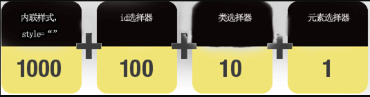
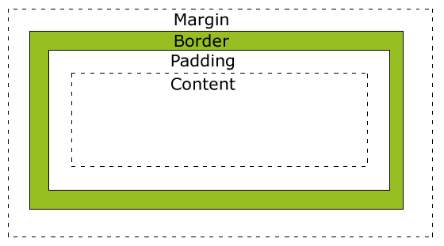

## [CSS](http://www.w3school.com.cn/css/css_jianjie.asp)

CSS 指层叠样式表 (**C**ascading **S**tyle **S**heets)

当同一个HTML元素被不知一个样式定义时，会按照一下优先级选择：

1. 内联样式（在HTML元素内部）
2. 内部样式表（位于<head>标签内部）
3. 外部样式表
4. 浏览器缺省设置


## id 选择器

id 选择器可以为标有特定 id 的 HTML 元素指定特定的样式。

HTML元素以id属性来设置id选择器,CSS 中 id 选择器以 "#" 来定义。

ID属性不要以数字开头，数字开头的ID在 Mozilla/Firefox 浏览器中不起作用。

ID属性只能在每个 HTML 文档中出现一次。

## class 选择器

class 选择器用于描述一组元素的样式，class 选择器有别于id选择器，class可以在多个元素中使用。

class 选择器在HTML中以class属性表示, 在 CSS 中，类选择器以一个点"."号显示

类名的第一个字符不能使用数字

## 外部样式表

当样式需要应用于很多页面时，外部样式表将是理想的选择。在使用外部样式表的情况下，你可以通过改变一个文件来改变整个站点的外观。每个页面使用 标签链接到样式表。 

```
<head> <link rel="stylesheet" type="text/css" href="mystyle.css"> </head>
```

不要在属性值与单位之间留有空格。

## 内部样式表

当单个文档需要特殊的样式时，就应该使用内部样式表。你可以使用 <style> 标签在文档头部定义内部样式表

```js
<head>
<style>
hr {color:sienna;}
p {margin-left:20px;}
body {background-image:url("images/back40.gif");}
</style>
</head>
```


## 内联样式

由于要将表现和内容混杂在一起，内联样式会损失掉样式表的许多优势。请慎用这种方法，例如当样式仅需要在一个元素上应用一次时

```js
<p style="color:sienna;margin-left:20px">这是一个段落。</p>
```

## 多重样式层叠

#### 多重样式优先级顺序，其中数字 7 拥有最高的优先权：

1. 通用选择器（*）
2. 元素(类型)选择器
3. 类选择器
4. 属性选择器
5. 伪类
6. ID 选择器
7. 内联样式

#### 权重计算:



以下是对于上图的解释：

- 内联样式表的权值最高 1000
- ID 选择器的权值为 100
- Class 类选择器的权值为 10
- HTML 标签选择器的权值为 1

#### CSS 优先级法则：

-  选择器都有一个权值，权值越大越优先；
-  当权值相等时，后出现的样式表设置要优于先出现的样式表设置；
-  创作者的规则高于浏览者：即网页编写者设置的CSS 样式的优先权高于浏览器所设置的样式；
-  继承的CSS 样式不如后来指定的CSS 样式；
-  在同一组属性设置中标有"!important"规则的优先级最大；

### CSS 盒子模型

所有HTML元素可以看作盒子，在CSS中，"box model"这一术语是用来设计和布局时使用。

CSS盒模型本质上是一个盒子，封装周围的HTML元素，它包括：边距，边框，填充，和实际内容。

盒模型允许我们在其它元素和周围元素边框之间的空间放置元素。



在盒模型中，外边距可以是负值，而且在很多情况下都要使用负值的外边距。

在IE5和6中width值并不等于content的宽度，而是指border+padding+content。

#### Positioning(定位)

- Fixed 定位：

  - 元素的位置相对于浏览器窗口是固定位置。
  - 即使窗口是滚动的它也不会移动。
  - Fixed定位使元素的位置与文档流无关，因此不占据空间。
  - Fixed定位的元素和其他元素重叠。

- Relative 定位：

  - 相对定位元素的定位是相对其正常位置。
  - 可以移动的相对定位元素的内容和相互重叠的元素，它原本所占的空间不会改变。

- Absolute 定位：

  - 绝对定位的元素的位置相对于最近的**已定位父元素**，如果元素没有已定位的父元素，那么它的位置相对于<html>。
  - Absolutely定位使元素的位置与文档流无关，因此不占据空间。
  - Absolutely定位的元素和其他元素重叠。

  ##### 重叠

- 元素的定位与文档流无关，所以它们可以覆盖页面上的其它元素

- z-index属性指定了一个元素的堆叠顺序（哪个元素应该放在前面，或后面）

- 一个元素可以有正数或负数的堆叠顺序


### Float(浮动)

CSS float 属性定义元素在哪个方向浮动，浮动元素会生成一个块级框，直到该块级框的外边缘碰到包含框或者其他的浮动框为止。

元素的水平方向浮动，意味着元素只能左右移动而不能上下移动。

一个浮动元素会尽量向左或向右移动，直到它的外边缘碰到包含框或另一个浮动框的边框为止。

浮动元素之后的元素将围绕它。

浮动元素之前的元素将不会受到影响。

如果图像是右浮动，下面的文本流将环绕在它左边