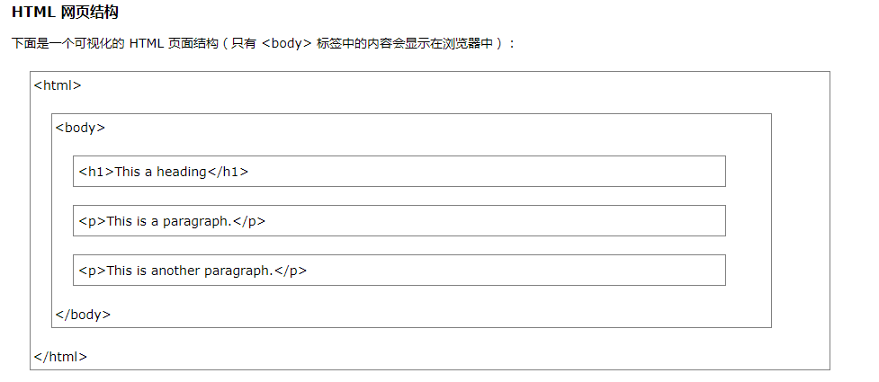
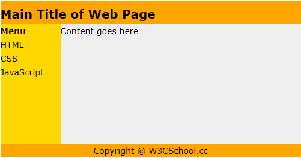
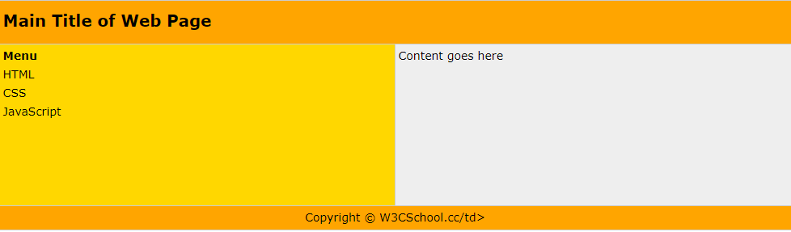

[速查列表](https://www.w3cschool.cn/html/html-quicklist.html)

[常用技巧](https://www.w3cschool.cn/html/html-code.html)

[网页模版](https://www.w3cschool.cn/html/html-template.html)

HTML（**h**yper **t**ext **m**arkup **l**anguage）

```HTML
<!DOCTYPE html>
<html>
<head>
	<title>这是个标题</title>
</head>
<body>
<h1>我的第一个标题</h1>
<p>我的第一个段落。</p>
</body>
</html>
```

<!doctype html>标签在HTML5中也有使用，表示文档类型 不区分大小写

-----

### 网页基本结构




### HTML元素

推荐使用小写

[HTML参考手册](https://www.w3cschool.cn/htmltags/html-reference.html)

**标题**：搜索引擎使用标题为您的网页的结构和内容编制索引。因为用户可以通过标题来快速浏览您的网页，所以用标题来呈现文档结构是很重要的。

**文本格式化**：
通常标签 <strong> 替换加粗标签 <b> 来使用， <em> 替换 <i>标签使用。然而，这些标签的含义是不同的： 
<b> 与<i> 定义粗体或斜体文本。 
<strong> 或者 <em> 意味着你要呈现的文本是重要的，所以要突出显示。

**链接**:

HTML 空链接：指指向链接后，鼠标变成手形，但单击后仍停留在当前页面。

```<a href="#">链接文字</a>```

**头部**：

```
<base>描述了基本的链接地址/链接目标，该标签作为HTML文档中所有的链接标签的默认链接:
<head>       
<base href="//www.w3cschool.cn/images/" target="_blank">      
</head>
```

```
<link> 标签定义了文档与外部资源之间的关系。
<link> 标签通常用于链接到样式表:    
<head>       
<link rel="stylesheet" type="text/css" href="mystyle.css">        
</head>
```

```
<style> 标签定义了HTML文档的样式文件引用地址.
在<style> 元素中你需要指定样式文件来渲染HTML文档:  
<head>        
  <style type="text/css">        
  	body {background-color:yellow}        
  	p {color:blue}        
  </style>        
</head>
```

```
meta标签描述了一些基本的元数据。
<meta> 标签提供了元数据。元数据也不显示在页面上，但会被浏览器解析。
META元素通常用于指定网页的描述，关键词，文件的最后修改时间，作者，和其他元数据。
元数据可以使用于浏览器（如何显示内容或重新加载页面），搜索引擎（关键词），或其他Web服务。
<meta>一般放置于 <head>区域

<meta> 标签- 使用实例
为搜索引擎定义关键词:   
<meta name="keywords" content="HTML, CSS, XML, XHTML, JavaScript">
为网页定义描述内容:    
<meta name="description" content="Free Web tutorials on HTML and CSS">
定义网页作者:    
<meta name="author" content="Hege Refsnes">
每30秒钟刷新当前页面:   
<meta http-equiv="refresh" content="30">
```

**图像**

```
 是空标签，意思是说，它只包含属性，并且没有闭合标签。
要在页面上显示图像，你需要使用源属性（src）。src 指 "source"。源属性的值是图像的 URL 地址。
定义图像的语法是：

Alt属性用来为图像定义一串预备的可替换的文本。
```

**表格**

```
<table border="1">
<tr>
<th>Header 1</th>
<th>Header 2</th>
</tr>
<tr>
<td>row 1, cell 1</td>
<td>row 1, cell 2</td>
</tr>
<tr>
<td>row 2, cell 1</td>
<td>row 2, cell 2</td>
</tr>
</table>
```

**列表**

```
<ul>无序列表
<ol>有序列表
自定义列表
<dl>
<dt>Coffee</dt>
<dd>- black hot drink</dd>
<dt>Milk</dt>
<dd>- white cold drink</dd>
</dl> 
```


**块级元素**：在浏览器显示时，通常会以新行来开始（和结束）。（<div> ）

**内联元素**：内联元素在显示时通常不会以新行开始。（<span>）


### 页面布局

1. 使用<div>元素

```
<!DOCTYPE html>
<html>
<body>

<div id="container" style="width:500px">

<div id="header" style="background-color:#FFA500;">
<h1 style="margin-bottom:0;">Main Title of Web Page</h1></div>

<div id="menu" style="background-color:#FFD700;height:200px;width:100px;float:left;">
<b>Menu</b><br>
HTML<br>
CSS<br>
JavaScript</div>

<div id="content" style="background-color:#EEEEEE;height:200px;width:400px;float:left;">
Content goes here</div>

<div id="footer" style="background-color:#FFA500;clear:both;text-align:center;">
Copyright © W3Cschools.com</div>

</div>

</body>
</html>
```



2.  使用表格

```
<!DOCTYPE html>
<html>
<body>

<table width="500" border="0">
<tr>
<td colspan="2" style="background-color:#FFA500;">
<h1>Main Title of Web Page</h1>
</td>
</tr>

<tr>
<td style="background-color:#FFD700;width:100px;">
<b>Menu</b><br>
HTML<br>
CSS<br>
JavaScript
</td>
<td style="background-color:#EEEEEE;height:200px;width:400px;">
Content goes here</td>
</tr>

<tr>
<td colspan="2" style="background-color:#FFA500;text-align:center;">
Copyright © W3Cschools.com</td>
</tr>
</table>

</body>
</html>
```



### 表单

```
<form name="input" action="html_form_action.php" method="get">

Username: <input type="text" name="user"><br>

Password: <input type="password" name="pwd"><br>

<label for="male">Male</label>
<input type="radio" name="sex" id="male" value="male"><br>
<label for="female">Female</label>
<input type="radio" name="sex" id="female" value="female"><br><br>

<input type="checkbox" name="vehicle" value="Bike">I have a bike<br>
<input type="checkbox" name="vehicle" value="Car">I have a car <br><br>

<input type="submit" value="Submit">

</form> 
```

### [字符实体](https://www.w3cschool.cn/html/html-entities.html)

[](https://www.w3cschool.cn/html/html-entities.html)


