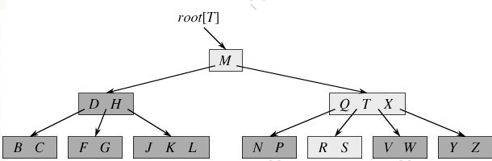
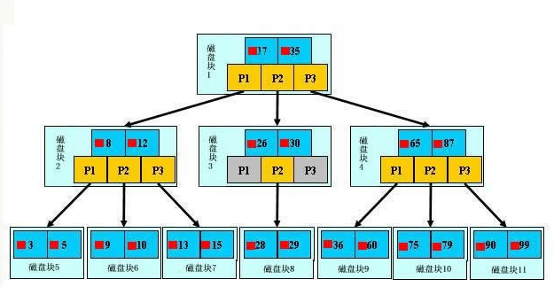
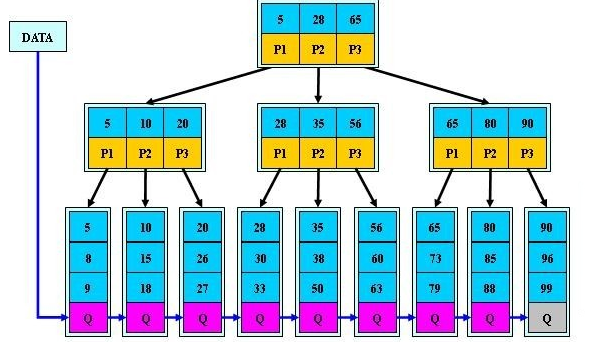

### 树的存储结构

- 双亲表示法：

  每个节点保存数据和双亲节点的位置

- 双亲孩子表示法：

  用链表表示，节点内容是：数据、双亲节点、孩子节点；在孩子节点里是个链表保存双亲节点的所有孩子

- 孩子兄弟表示法

  用二叉链式存储结构：数据、最左孩子指针、右兄弟指针

树的先序遍历和对应的二叉树的线序遍历一样，树的**后序遍历**和对应二叉树的**中序遍历**是一样的。

### 森林

并查集——集合

根节点作为代表元，节点有指向双亲节点的坐标

合并操作

1. 加权合并规则法

   节点少的树指向节点多的树的根节点。（将所有根节点存储的“-1”改为该树的节点个数）

2. 路径压缩法

   在查找节点所在树的根节点的过程，将查找路径上每个节点的双亲节点作为根节点

### B树

一棵m阶的B树

1. 每个节点最多含有m个子树
2. 如果根节点不是终端节点，则最少有2棵子树
3. 除根节点之外的所有节点字少至少有（m/2）个子树
4. 关键字按照升序排序；指针指向的节点关键字全部比前一个关键字大，比后一个关键字小。
5. 叶子节点在同一层，不包含所有信息

### B+树

1. 有n棵子树的结点中含有n-1个关键字
2. 所有的叶子结点中包含了所有关键字信息
3. 所有的非终端结点可以看成是索引部分

B+树比B树更适合实际应用中作为文件索引和数据库索引：

1. B+树的磁盘读写代价更低
2. B+树的查询效率更稳定
3. B树在提高了磁盘IO性能的同时并没有解决元素遍历的效率低下的问题；B+树只要遍历叶子节点就可以实现整棵树的遍历。而且在数据库中基于范围的查询是非常频繁的

### 二叉树

性质：

1. 非空二叉树第i层最多有2^i个节点
2. 深度为k最多有2^k-1个节点
3. 度为0的结点个数为n0，度为2的结点个数为n2，则n0=n2+1

先序遍历，中序遍历、后序遍历

### 堆

所有非叶子节点均不大于或不小于其左右孩子节点

建堆依次将编号为n/2、n/2-1、……、1的节点为根的子树筛选。

### 二叉查找树/二叉排序树

1. 若左子树不空，则左子树上所有结点的值均小于根结点的值
2. 若右子树不空，则右子树所有结点的值均大于根结点的值
3. 左右子树都是二叉查找树

### 平衡二叉树

空树或者是左子树与右子树的高度差的绝对值不超过1的二叉查找树

失衡调整：

1. LL型右旋
2. RR型左旋
3. LR型先左旋再右旋
4. RL型先右旋再左旋

### 红黑树

[红黑树](https://github.com/julycoding/The-Art-Of-Programming-By-July/blob/master/ebook/zh/03.01.md)，本质上来说就是一棵二叉查找树，但它在二叉查找树的基础上增加了着色和相关的性质使得红黑树相对平衡，从而保证了红黑树的查找、插入、删除的时间复杂度最坏为O(log n)，保证一棵n个结点的红黑树的高度始终保持在h = logn。

1. 每个结点要么是红的，要么是黑的。  
2. 根结点是黑的。  
3. 每个叶结点（叶结点即指树尾端NIL指针或NULL结点）是黑的。  
4. 如果一个结点是红的，那么它的俩个儿子都是黑的。  
5. 对于任一结点而言，其到叶结点树尾端NIL指针的每一条路径都包含相同数目的黑结点。  
