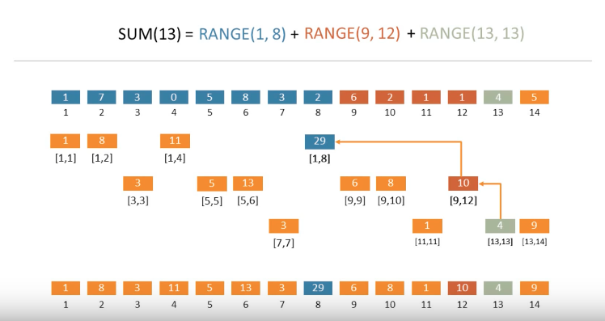

图中第一行为原数组，第二到第四行为依次按层填坑的过程。我们需要从左到右，从上到下依次将相应的值填入对应的位置中。最后一行中即为最终所形成的树状数组。

以图中第二行，也就是构造树状数组第一层的过程为例，我们首先需要填充的是数组中第一个数字开始，长度为2的指数个数字的区间内的数字的累加和。所以图中分别填充了从第一个数字开始，长度为2^0, 2^1, 2^2, 2^3的区间的区间和。到此为止这一步就结束了。因为2^4超过了我们原数组的长度范围。

下一步我们构造数组的第二层。与上一层类似，我们依然填充余下的空白中从第空白处一个位置算起长度为2的指数的区间的区间和。例如3-3空白，我们只需填充从位置3开始，长度为1的区间的和。再如9-14空白，我们需要填充从9开始，长度为2^0（9-9），2^1（9-10），2^2（9-12）的区间和。

类似地，第三层我们填充7-7，11-11和13-14区间的空白。

到此为止，我们已经完全的构造了对应于输入数组的一个树状数组。将该数组即为BIT（方便起见，此处对此数组的索引为从1开始）.
