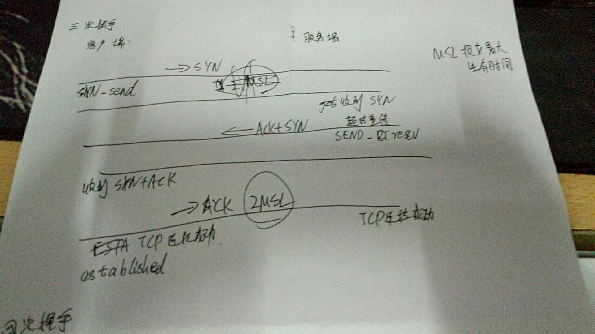
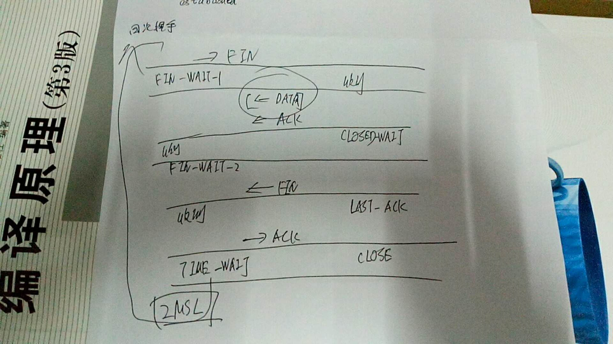

### TCP（Trajnsmission Control Potocol）传输控制协议

1. 面向连接（三次握手、四次挥手）
2. 可靠传输（序列号/确认号， 重传机制）
3. 流量控制（滑动窗口）
4. 多路复用

telnet远程登录

### 三次握手：

1. 客户端发送SYN
2. 服务端收到后，回发ACK+SYN
3. 客户端发送ACK

### 四次挥手：

1. 客户端发送FIN

2. 服务端发送ACK

   中间可以有数据传输

3. 服务端发送FIN

4. 客户端发送ACK

### 流量控制

- 使用滑动窗口进行控制
- 接受方在建立连接时会有一个窗口大小（rwnd = ‘400’， 表示要求发送400个字节）,发送确认ACK的时候会将rwnd一起发过去。
- 当接受方窗口为0之后，发送方会暂停，直到接受发送自己需要的rwnd。但是这个报文段会丢失，这时两方都在等，一段时间后发送方发个一字节的探测报文段。

### 拥塞控制

1. **慢开始**和**拥塞避免**：

   发送方维持一个**拥塞窗口**（cwnd=1），大小取决于网络拥塞状况

   - 慢开始： 设置一个最大报文段（MSS），每次收到确认报文后 cwnd增加一个MSS
   - 拥塞避免： 设慢开始门限（ssthresh），超过这个值就开始拥塞避免

2. **快重传**与**快恢复**

   - 快重传：当发送方连续收到三个重复确认时（网络开始拥塞），重新开始慢开始过程
   - 快恢复：当出现快重传的时候不执行慢开始，而是从慢开始门限（ssthresh）开始拥塞避免算法