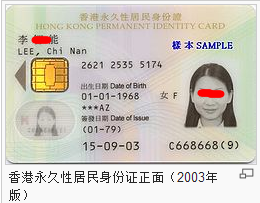
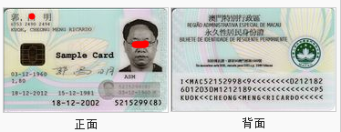
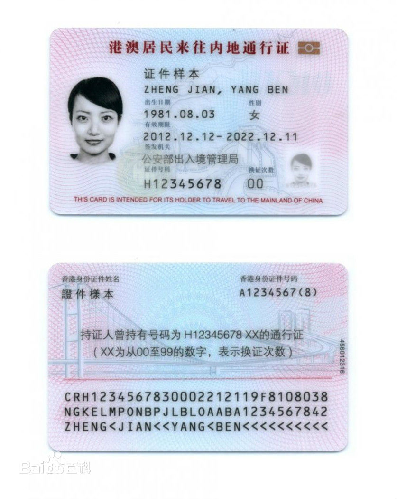

## 中国大陆身份证号码

- ### 第一代身份证号码

长度为15位：6位区域编码+6位出生日期+3位编码（ABC）

其中AB是当地的详细代码，C是性别代码（奇数男性、偶数女性）

6位区域编码规则可以从表格查找（香港、澳门、台湾也能持有大陆居民身份证）

[中国省市县地区代码一览表](https://www.ip33.com/area_code.html)

[国家行政划分](http://www.mca.gov.cn/article/sj/xzqh/2019/2019/201912251506.html)

[全国代码数据库](https://github.com/eduosi/district/blob/master/README.md)

> 如果同一天内，同一个地区出生的婴儿超过999个，是不是就出现重号了？
不是的。首先是当地的详细代码其实没有占满了，当超过的时候就可以借用其他没有使用的；其次，按照出生婴儿计算，如果同一天、同一区域内有超过1000个婴儿，那么就相当于当地任意一天内有大约30万的孕妇（网上统计结果），当地的医院能否承受这种压力。最后，按照中国出生率计算，一个地区也没有这么多的婴儿出生（中国现在的出生率正在下滑）

公民身份证号码由15位升至18位的工作自1999年10月1日起，2000年年底将全部完成。后续换卡（丢失补卡、到期换卡）或者新生儿的身份证号码全部使用第二代。

- ### 第二代居民身份证号码

长度为18位：6位区域编码+8位出生日期+3位编码+1位校验码

其中3位编码含义没有改变，最大的变化是增加了最后一位校验码，

### 校验算法

具体来说就是，将前面17为数字进行加权运算之后再取余，余数就是结果数组的坐标

```
//权值
int power = {7,9,10,5,8,4,2,1,6,3,7,9,10,5,8,4,2};
//结果数组
String[] res = "10X98765432"
int temp = 0;
for (int i = 0; i < 17; i++)
{
	temp += Convert.ToInt32(idcard[i].ToString()) * power[i];
}
temp = temp % 11;
```

## 香港身份证号码

示例：



香港身份证号码由三部分组成：一个英文字母；6个数字；括号及0-9中的任一个数字，或者字母A。

括号中的数字或字母A，是校验码，用于检验括号前面的号码的逻辑正确性。

### 身份证其它部分说明

1. 芯片储存持证人士的个人资料，包括持证人指纹及电子证书等

2. 在姓名下方的数字串，是姓名的中文电报号码，代表中文姓名，比如2621 =李，2535=智，5174=能。

3. 在出生日期右边是性别：女F，男M。F代表女，M代表男

4. 在出生日期之下，会印有一串符号及英文字母（例如***AZ，这也让人们成为星星卡）

5. 在签发日期的下方，分别为第一次领取身份证的时间和本证的签发（换发）时间。如上例：

   （01-79），表示第一次领取身份证的时间是1979年1月；

   15-09-03，表示本证签发（换发）时间为2003年9月15日。

> *** 持证人年龄为18岁或以上及有资格申领香港特别行政区回港证
>
> \* 持证人年龄为11岁至17岁及有资格申领香港特别行政区回港证
>
> A 持证人拥有香港居留权
>
> B 持证人所报称的出生日期或地点自首次登记以后，曾作出更改
>
> C 持证人登记领证时在香港的居留受到入境事务处处长的限制
>
> N 持证人所报的姓名自首次登记以后，曾作出更改
>
> O 持证人报称在香港、澳门及中国以外其他地区或国家出生
>
> R 持证人拥有香港入境权
>
> U 持证人登记领证时在香港的居留不受入境事务处处长的限制
>
> W 持证人报称在澳门地区出生
>
> X 持证人报称在中国大陆出生
>
> Z 持证人报称在香港出生

### 校验算法

字母转为（1~26）乘以8 + 6个数字乘以权值，求和取余11，再获得校验码

```
先把首位字母改为数字，即A为1，B为2，C为3...Z为26，再乘以8；然后把字母后面的6个数字依次乘以7、6、5、4、3、2；再将以上所有乘积相加的和，除以11，得到余数；如果整除，则括号中的校验码为0，如果余数为1，则校验码为A，如果余数为2～10，则用11减去这个余数的差作校验码。

使用示例进行计算：C668668（9）
//权值
int[] power = {7,6,5,4,3,2};
// 字母计算 
int letter  = int('C')*8;
int res = letter
int temp = 0;
for (int i = 0; i < 6; i++)
{
	temp += Convert.ToInt32(idcard[i+1].ToString()) * power[i];
}
temp += letter;
temp = temp % 11;
if(temp==1){
	return A;
}else{
	return 11-temp;
}
// 3*8 + 6*7 + 6*6 + 854 + 6*4 + 6*3 + 8*2 = 1014
// 1014 % 11 = 2
// 11 - 2 = 9
```

## 澳门身份证号码



澳门身份证号码由8个拉丁数字组成，格式为：XNNNNNN(Y)。其中：

第一位X（代表取证时代），可能是1、5、7。绝大多数人以1字开首；以5字开首的身份证号码代表持有或曾经持有葡萄牙国民身份证或葡萄牙给外国人身份证之人士；以7字开首代表曾经取得蓝卡之人士，大多都是在1970年代至1980年代期间从中国大陆持合法证件到澳门的人士。

最后一位Y（数字或者大写字母），是查核用数字，是为方便电脑处理资料及检查号码输入的正确性而设。

中间6位数字，是发证当局给出的顺序号。

### 身份证其它部分

在澳门身份证的照片下面，会印有葡萄牙文字母（例如ASM），它代表的意思如下：

A 持证人于澳门出生

B 持证人于香港出生

C 持证人于中国大陆、台湾出生

D 持证人于其他国家及地区出生

N 持证人出生地不明，不知道自己在何处出生

S 持证人有出生证明文件。如无出生证明文件则会漏空。

M 持证人为男性（Masculino）

F 持证人为女性（Feminino）

### 没有找到校验算法

## 台湾身份证号码

中国台湾地区的身份证称为“国民身份证”，号码一共有10位，第1位是大写的英文字母，后9位是阿拉伯数字。比如：U193683453。

第一位大写的英文字母是地区编码，代表初次登记的户籍所在地，比如，U代码花莲县。每个地区编码还对应有一个两位数的验证码，用于公式验证。

首位数字代表性别，男性为1、女性为2；最后一位数字是检验码；其它是电脑系统给码

> 英文 县市 / 地区 验证码（数字）
>
> A 台北市 10
>
> B 台中市 11
>
> C 基隆市 12
>
> D 台南市 13
>
> E 高雄市 14
>
> F 台北县 15
>
> G 宜兰县 16
>
> H 桃园县 17
>
> I 嘉义市 34
>
> J 新竹县 18
>
> K 苗栗县 19
>
> L 台中县 20
>
> M 南投县 21
>
> N 彰化县 22
>
> O 新竹市 35
>
> P 云林县 23
>
> Q 嘉义县 24
>
> R 台南县 25
>
> S 高雄县 26
>
> T 屏东县 27
>
> U 花莲县 28
>
> V 台东县 29
>
> W 金门县 32
>
> X 澎湖县 30
>
> Y 阳明山管理局 31
>
> Z 连江县 33

### 校验算法

```
最后一位数字是检验码，通过公式计算得到。计算公式如下：

通算值= 首字母对应的第一位验证码+ 首字母对应的第二位验证码 * 9 + 性别码 * 8 + 第二位数字 * 7 + 第三位数字 * 6 + 第四位数字 * 5 + 第五位数字 * 4 + 第六位数字 * 3 + 第七位数字 * 2 + 第八位数字 * 1

最后一位数 =10- 通算值的末尾数。

例如，A234567893，
A对应的验证码是10(查表)
通算值= 1 + 0*9 + 2*8 + 3*7 + 4*6 + 5*5 + 6*4 + 7*3 + 8*2 + 9*1 = 157
通算值的末尾数是7。
则10-7=3
```

## 港澳居民来往内地通行证



“H”字头签发给香港居民，“M”字头签发给澳门居民；第2位至第11位为数字，前8位数字为通行证持有人的终身号，后2位数字表示换证次数，首次发证为00，此后依次递增。

## 正则表达式

```
//大陆身份证号码校验
var isMatch = identityCard.match(/^[1-9]\d{5}(18|19|2\d{1})\d{2}((0[1-9])|(10|11|12))(([0-2][1-9])|10|20|30|31)\d{3}[0-9Xx]$|^[1-9]\d{5}\d{2}((0[1-9])|(10|11|12))(([0-2][1-9])|10|20|30|31)\d{3}$/);
  
//香港身份证号码校验
//开头一位大写字母，然后接上6位数字，最后一位数字或字母校验
var isMatchHongKong = identityCard.match(/^[A-Z]{1}[0-9]{6}(\(|（)?[0-9A](（|\))?$/);
 
//澳门身份证号码校验
//开头数字1或者5或者7，然后接上6位数字，再接上一位数字或者大写字母校验
var isMatchAoMen = identityCard.match(/^[1|5|7][0-9]{6}(\(|（)?[0-9A-Z](（|\))?$/);
 
//台湾身份证号码校验
//开头一位大写字母，接上9位数字
var isMatchTaiWan = identityCard.match(/^[A-Z][0-9]{9}$/);

// 军官证
// 规则： 军/兵/士/文/职/广/（其他中文） + "字第" + 4到8位字母或数字 + "号"
// 样本： 军字第2001988号, 士字第P011816X号
var reg = /^[\u4E00-\u9FA5](字第)([0-9a-zA-Z]{4,8})(号?)$/;

// 户口本
// 规则： 15位数字, 18位数字, 17位数字 + X
// 样本： 441421999707223115
var reg = /(^\d{15}$)|(^\d{18}$)|(^\d{17}(\d|X|x)$)/;

// 港澳居民来往内地通行证
// 规则： H/M + 10位或6位数字
// 样本： H1234567890
var reg = /^([A-Z]\d{6,10}(\(\w{1}\))?)$/;
```

